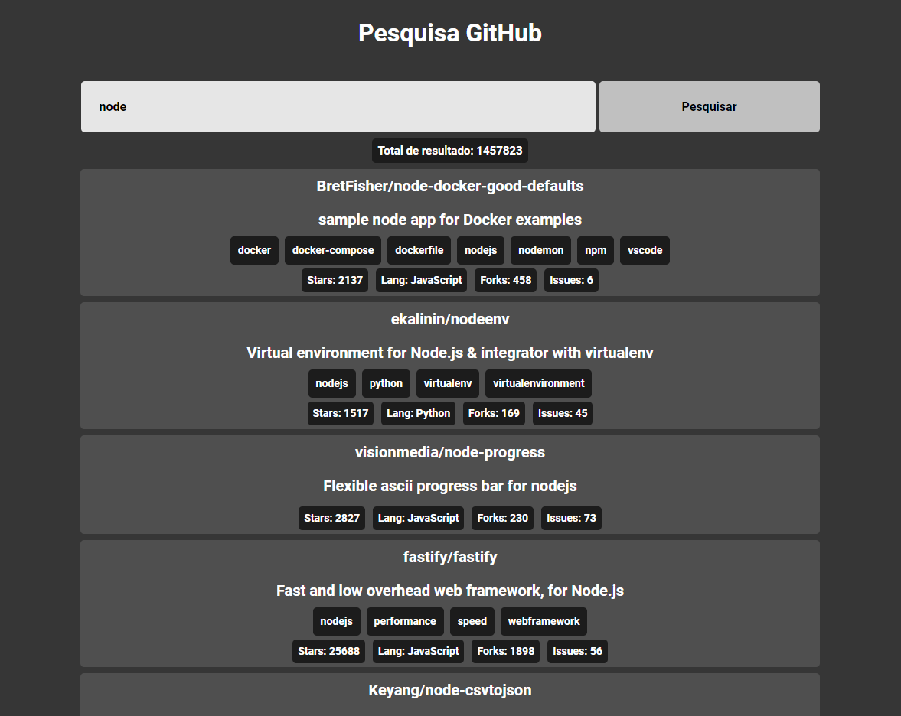

## 💻 Como iniciar o projeto

- npm install
- npm run dev

## 💻 Framework, linguagem e ferramentas:

Projeto desenvolvido com React JS puro.

## 💻 Técnologias X e Y:

Escolhi a biblioteca do React JS pois é a que eu tenho mais familiaridade, e a que eu estou estudando atualmente.

## 💻 Princípios de software:

- Vite
- Css.
- Typescript.
- Componentização.
- Comsumo de API Github.

## 💻 Desafios e problemas que você enfrentou e como você resolveu

Meu maior desafio foi entender e extrair a api.
Depois tive uns problemas com a paginação.

## 💻 Melhorias e próximas implementações

Melhorias no design e usabilidade, responsividade, implementar novos usos para a aplicação, todo projeto sempre tem melhorias.

## 💻 Sobre você

Olá, sou de Poloni - SP, tenho 26 anos, desde pequeno sempre fui apaixonado por tecnologia, quando tinha 7 anos tive o primeiro contato com um computador, foi amor a primeira vista, ficava horas e horas na lan house com os amigos, fui crescendo e me aperfeiçoando aprendi montar e desmontar um computador do zero, em 2019 em meio de um jogos com uns amigos, conheci a programação, desde então venho estudando e me especializando na área, tenho diversos cursos, como montagem e manutenções de computadores, Designer gráfico, React.js e etc...
recentemente recebi meu diploma de Full Stack Development, pela escola Tera Cursos.
Sou especializado em Front-End.

## 💻 Contato

- Linkedin: https://www.linkedin.com/in/brunocatan/
- E-mail: brunocatandev@gmail.com
- Celular: (17) 99281-7472
