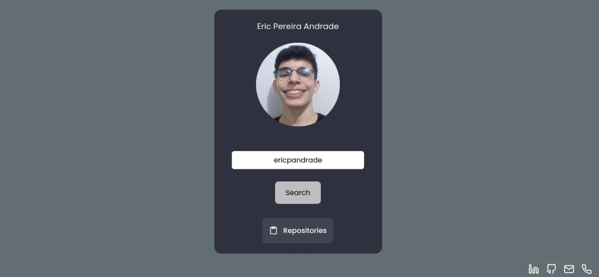
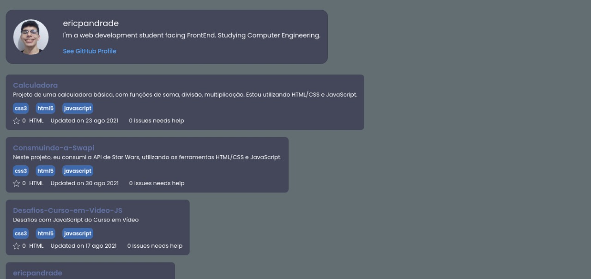
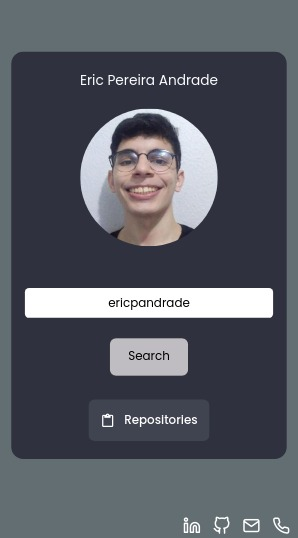
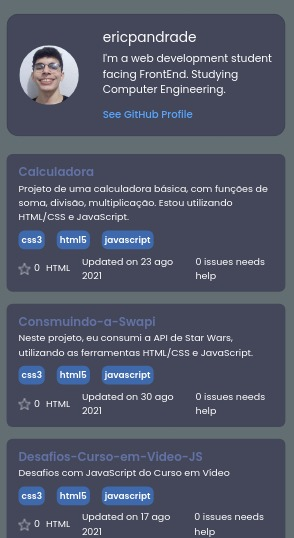

<link rel="preconnect" href="https://fonts.googleapis.com">
<link rel="preconnect" href="https://fonts.gstatic.com" crossorigin>
<link href="https://fonts.googleapis.com/css2?family=Poppins:wght@700&display=swap" rel="stylesheet">

# GitHub Api

<span style="font-family: 'Poppins', sans-serif;font-size:9pt">
Realizei uma aplicação, onde consome a API do GitHub, com o intuito de treinar as habilidades de React/Typescript. Utilizei as ferramentas React-router-dom, Context, States, Hooks e treinei o ciclo de vida com o useEffect, acabei utilizando também localStorage, para treinar um pouco da manipulação de dados pelo local.
</span>

<br/>
<br/>

## Demo

<span style="font-family: 'Poppins', sans-serif;font-size:9pt">

Você pode acompanhar o site pelo Link: https://git-hub-api-nu.vercel.app/

</span>

<br/>

## Installation

<span style="font-family: 'Poppins', sans-serif;font-size:9pt">
Install my-project with npm
</span>

```bash
  npm install my-project
  cd my-project
```

## Run Locally

<span style="font-family: 'Poppins', sans-serif;font-size:9pt">
Clone the project
</span>

```bash
  git clone https://link-to-project
```

<span style="font-family: 'Poppins', sans-serif;font-size:9pt">
Go to the project directory
</span>

```bash
  cd my-project
```

<span style="font-family: 'Poppins', sans-serif;font-size:9pt">
Install dependencies
</span>

```bash
  npm install
```

<span style="font-family: 'Poppins', sans-serif;font-size:9pt">
Start the server
</span>

```bash
  npm run start
```

<br />
<br />

 <span style="font-family: 'Poppins', sans-serif;font-size:20pt"> Designs<span>

<br/>

### **Desktop**

<br />





<br/>
<br/>

### **Mobile**

<br />





<br/>
<br/>

# Entrega

<ul>
  <li>Qual ferramentas e bibliotecas (libraries, framework, tools etc) você usou?</li>

  <span style="font-family: 'Poppins', sans-serif;font-size:9pt">
    React.
  </span>

  <br/>

  <li>
  Porque você optou pela tecnologia X e não a Y
  </li>
  <span style="font-family: 'Poppins', sans-serif;font-size:9pt">
      Optei por utilizar React, devido a familiaridade com a biblioteca/framework, pois baseei meus estudos em react, até o momento, utilizei também Typescript, devido a facilidade que a linguagem causa e a prevenção de erros.
  </span>

  <br/>

  <li>
    Quais princípios da engenharia de software que você usou?
  </li>

  <span style="font-family: 'Poppins', sans-serif;font-size:9pt">
    Planeje com antecedência, visando a reutilização.
    Esse projeto, eu já tinha construído, mas acabei acrescendo mais algumas funcionalidades, mais interação com a API, consumindo ela de forma melhor, resolvendo alguns pequenos bugs.
    O que um produz outros consomem
    Deixei o projeto de forma que outras pessoas consigam utilizar de forma mais fácil, com a fácil interação com a API, tentei deixar o mais legível possível as nomenclaturas para deixar o código legível e simples.
  </span>

  <br/>

  <li>
    Desafios e problemas que você enfrentou e como você resolveu
  </li>
  <span style="font-family: 'Poppins', sans-serif;font-size:9pt">
    Resolver erros de transição de página, para não deixar o usuário burlar a segurança de passar para outra página, resolver erros de nome, como o "null" e deixar o site de forma mais simples possível para o usuário, com que ele não tenha estresse de utilização e encontrar algum bug.
  </span>

  <br/>

  <li>
    O que você entende que pode ser melhorado e como fazer isso
  </li>

  <span style="font-family: 'Poppins', sans-serif;font-size:9pt">
    Acredito que dê para facilitar a leitura do código, acrescentar context para as Api's facilitando a utilização delas e tornar o código mais fácil para desenvolvimentos futuros, não cheguei a colocar pois estou bem ocupado com a faculdade, peço desculpas... Acrescentar mudança de tema, pois o layout está apenas em dark mode e algumas pessoas preferem o light mode, utilizar styled components, para facilitação com os estilos, deixar mais limpo o código, com melhoria no funcionamento da aplicação e organização do código para se passar adiante, como pastas que indiquem o código + o estilo e aonde ele será colocad, etc...
  </span>

  <br/>

</ul>

## Contact

<div> 
  
  <a href = "mailto:ericpandrade085@gmail.com"></a>
  <a href="https://www.linkedin.com/in/eric-pereira-andrade-872a01210/" target="_blank"></a> 
  <a href="https://api.whatsapp.com/send?phone=+5585989828188&text=Olá! Gostaria de entrar em contato." target="_blank"></a>

</div>

<span style="font-family: 'Poppins', sans-serif;font-size:9pt; font-style:italic">
Project made by Eric Pereira Andrade.
</span>
