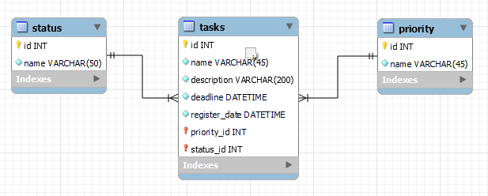

## Envio de solução

## Gostariamos de entender como você pensa e as decisões que você tomou durante o desenvolvimento, detalhe um pouco mais sobre:
Primeiramente foquei em construir um mvp, aplicação inicial que funcionasse com as funcionalidades básicas, sem muita estilização e lógica muito complexa. Apenas utilizando memória local e arrays para armazenar as tarefas cadastradas. 
O segundo passo foi fazer com que as tarefas fossem armazenadas em um arquivo json para consumí-lo via http request e simular um servidor com json-server. 
Após toda a base funcionar, decidí organizar melhor os componentes e criar funções mais específicas. 
A ultima coisa que a ser implementada foram os estilos e design da página. 
Por fim revisei o projeto, "limpei" um pouco o código refatorando redundâncias e códigos desorganizados, e documentando todo o projeto no caminho. 

## Descreva ferramentas e bibliotecas (libraries, framework, tools etc) você usou.
Utilizei:
- Módulos como FormControl, MatDialogModule, etc... do Angular Material design para otimizar o planejaento e a implementação do UI/ UX design do front-end: Escolhí utilizar o Angular Material Design para otimizar o desenvolvimento do front-end pois me aparentou ser uma biblioteca muito bem documentada e simples de ser utilizada, e como nunca tive um contato prévio com Angular (estou mais acostumado a utilizar React) seria de grande valia utilizá-la e acabou viabilizando algumas partes do projeto, como o formulário para cadastro de tarefas em formato e modal e inserção de ícones e menú drop down. 
- Json-server para simular um servidor que conecta o front-end da aplicação com um banco de dados fictício (arquivo db.json): Utilizei o json server para simular uma aplicação real com back-end pois não tenho conhecimento em Node e Nest js (até o momento só tenho domínio do PHP como ferramenta de back-end), e por não estar acostumado com Angular não haveria tempo útil para aprender todas as tecnologias solicitadas. Ainda assim, queria desenvolver o melhor projeto possível e que atendesse a maior parte dos requisitos solicitados. Por este motivo optei por utilizar o json server com um documento json para simular o banco de dados. 
- Git para versionar e documentar melhor o código / github para enviar o projeto para um repositório remoto e ter uma acesso mais facilitado ao mesmo.
- VsCode como IDE e editor de texto: É o editor de código que me sinto mais confortável para o ecossistema JavaScript, apenas por uma questão de costume, pois utilizo-o a bastante tempo. 
- Google fonts para importação da fonte Inter que foi utilizada no projeto: A escolha desta fonte se deu por ser uma fonte bonita, simples e elegante. Além de sua grande versatilidade que a faz encaixar-se muito bem na maioria dos templates.   

## Quais princípios da engenharia de software que você usou?
Ainda que o projeto seja simples, acredito que foram utilizados princípios fundamentais da engenharia de software. 
- Separação de responsabilidade: Dividí o código em componentes e serviços, seguinto a estrutura do Angular e facilitando futuras manutenções e a reutilização do código.
- Modularização: Utilizando corretamente a estrutura do Angular, cada serviço passa a ser uma unidade isolada com um papel bem definido na aplicação. 
- Reutilização do código: Apesar de acreditar que pequei um pouco neste tópico, devido a inexperiência com o framework, conseguí evitar o máximo de redundâncias como na utilização dos cards para as tarefas que são renderizadas em cada quadro. Seguindo assim, o princípio DRY (Dont Repeat Yourself)
- Abstração: Utilizei services para lidar com as requisições HTTP, desta forma separei a lógica de dados das regras de negócio e apresentação, abstraindo os detalhes da API (json-server)
- Tipagem estática: O uso de TypeScript para atribuir verificação de tipos estática ao JavaScript permite uma melhor manutenibilidade e principalmente, maior controle e precaução de erros no código, limitando a margem de possíveis erros.
- Acessibilidade (UX/ UI Design): Me dediquei para planejar e implementar uma interface de usuário simples e intuitiva, seguindo algumas recomendações e diretrizes aprendidas na faculdade e conhecimentos da comunidade, como uso de cores (vermelho, amarelo e verde) nos quadros para expressar melhor a usabilidade de cada quadro, uso de ícones, interface limpa e sem elementos desnecessários, hierarquia semântica (tamanho de fontes, peso da fonte e cores utilizadas), entre outros. 

**Desafios e problemas**
## Conte um pouco sobre os desafios e problemas que você enfrentou e como você resolveu.
Este teste foi bem desafiador, pois como mencionei acima, nunca havia programado em Angular anteriormente. Por este motivo precisei aprender os conceitos básicos praticamente do zero. 
Apesar da falta de experiência com o framework, acredito que o fato de possuir um solido conhecimento em lógica de programação e na linguagem JavaScript, além de já estar relativamente acostumado com o React acabou sendo de grande valia para reduzir um pouco a curva de aprendizado e tornar possível a implementação do desafio a tempo. 
Percebí que Angular utiliza muitos conceitos e fundamentos se forma semelhante ao React, como o uso de componentes, a modularização, abstração e separação de responsabilidades. Porém me pareceu uma ferramenta um pouco mais complexa (e também mais completa), este desafio me introduziu ao Angular e me gerou interesse o suficiente para continuar estudando o framework. 

**Melhorias e próximas implementações**
Gostaria de inserir uma ordem de prioridade nas tarefas, ranquando-as e organizando em ordem de prioridade nos quadros, porém não tive tempo o suficiente para implementar esta feature. 
Devido a falta de conhecimento em Node e Nest, também não conseguí criar um back-end como eu gostaria e aplicar melhor os meus conhecimentos em conceitos como banco de dados. 
Em um próxima implementação criaria um banco de dados seguindo o seguinte diagrama: 

Por fim, acredito que pequei um pouco na reutilização dos componentes, pois criei um componente "board" para representar os quadros, e dentro de cada quadro, seriam incluídas as tarefas que idealmente deveriam ser separadas em um outro componente componente , além do fato de ter repetido 3x o mesmo código (escrevendo o mesmo código 3x para cada quadro). 

**Vídeo de apresentação**
## Grave um vídeo do seu projeto rodando e envie o link:
- [Link para o vídeo](https://drive.google.com/file/d/1jYQmQDx1g7X5Nl4tdGXrWQO20Ck_XGol/view?usp=sharing)

**Sobre você**
## Queremos te conhecer um pouco melhor, conte um pouco sobre você.
Nascí em São José do Rio Preto, e sempre morei na cidade. Estudei quase toda a minha vida no colégio ao lado da minha casa (Colégio Universitário), e quando decidí ingressar na faculdade comecei a cursar Ciência da computação na UNIP. 
Com a chegada da pandemia precisei trancar o curso, principalmente por motivos financeiros, e após quse 2 anos voltei a fazê-lo na UNIRP, onde estudo até hoje (meu último ano, se tudo der certo).
Nunca trabalhei na área de tecnologia anteriormente, mas já trabalhei no setor administrativo nas empresas HB Saúde e Pevetur Transportes e Turismo (meu último emprego) e até mesmo como representante comercial do segmento de perfumaria na empresa Martins Atacadista, uma das maiores distribuidoras da américa latina. 
Há mais de um ano estou me programando para ingressar no mercado de tecnologia, preferencialmente como desenvolvedor de software/ web, mas estava encontrando dificuldades para conseguir me preparar devido o trabalho em tempo integral e faculdade a noite. Por este motivo, me planejei financeiramente e saí do meu último emprego em janeiro deste ano. Venho estudando e me aprimorando desde então e utilizo meu tempo para elaborar alguns projetos pessoais.
Minha história com desenvolvimento de software surgiu quando ainda tinha 16 anos, com a curiosidade de entender como os jogos eram criados. Ironicamente, não sou um gamer praticante nos dias atuais, há um bom tempo não jogo nenhum jogo eletrônico. Com o tempo conhecí o conceito de blockchains e me encantei completamente com a tecnologia, o que me levou a ingressar na faculdade de Ciência da computação, ainda que eu imaginasse desde o começo que no decorrer do curso encontraria uma área que me interessasse mais. 
Até hoje, o segmento de blockchains continua me intrigando e sendo um dos meus assuntos preferidos na área de tecnologia, tanto que estou usando como tema para o meu TCC. Apesar disso, mudei minha ideia inicial e não penso mais em trabalhar na área pelomenos no curto e médio prazo, tendo me interessado mais pela área de desenvolvimento de software devido um mercado mais amplo e versátil, além da possibilidade de contribuir com projetos mais fatídicos.    

**Outros detalhes**
## Se quiser enviar alguma informação adicional sobre o desafio..
Gostaria de compartilhar minha gratidão pela oportunidade de participar do desafio, verdadeiramente foi uma experiência muito relevante pra mim. Sinto que melhorei muito e conseguí me desafiar e superar alguns limites para concretizar a entrega do projeto. 

---

## Informações pessoais: 
**Nome** : Pedro Henrique Schiavetto
**E-mail** : pedro.schiavetto@gmail.com
**Telefone** : (17) 9 9105-6180
**GitHub** : github.com/skiavetto

