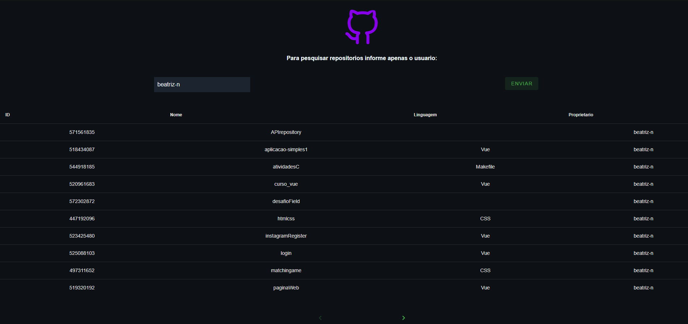
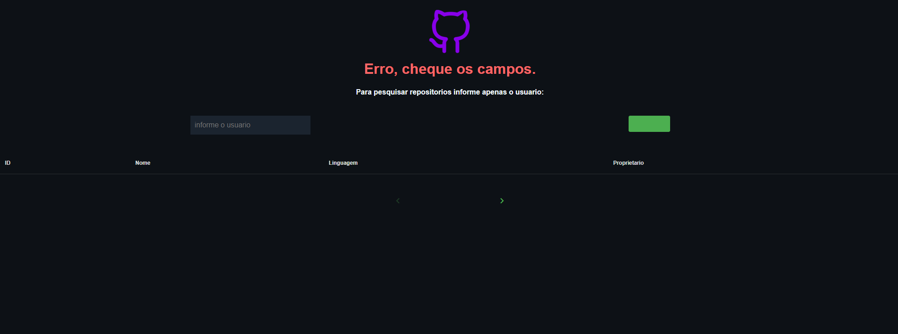

## Envio de solução

Gostariamos de entender como você pensa e as decisões que você tomou durante o desenvolvimento, detalhe um pouco mais sobre:

    Pesquisei sobre a API do Github, fiz algumas buscas para observar como funcionava a API, como poderia puxa-la ao meu programa, não teve muito segredo.

**Framework, linguagem e ferramentas**

Descreva ferramentas e bibliotecas (libraries, framework, tools etc) você usou.

    Usei 2 frameworks, VueJS e Vuetify, tambem precisei do axios, nunca usei, foi mais facil do que imaginei.

**Técnologias X e Y**

Justifique porque você optou pela tecnologia X e não a Y?

    Sinceramente, usei este framework pois já estava familiarizada e gosto do Vuetify (um framework com codigos prontos: inputs, alerts, lists e etc).

**Princípios de software**

Quais princípios da engenharia de software que você usou?

    KISS (Keep It Simple, Stupid!):
    Tentei não complicar minha resolução do problema.
 
    Mantenha a visão:
    Mantive minha visão sobre os objetivos e requisitos que precisava
  
    Esteja aberto para o futuro:
    Meu codigo está amplamente aberto para melhorias, já vejo varias há ele.

**Desafios e problemas**

Conte um pouco sobre os desafios e problemas que você enfrentou e como você resolveu.

    Tive dor de cabeça com instalação de pacotes, já estou familiarizada com eles, mas uma das instalações deu muitos erros, acabei abrindo outro arquivo e tentando não repetir o que tinha feito no anterior.
    Paginação foi um desafio, não sabia o que era um paginação da API, fiz algumas pesquisas, assisti videos, mas não consegui fazer, não consegui pensar na logica, porêm puxei do banco da API o "perPage" no endpoint. Deixarei os fragmentos de meu pensamento comentado.

**Melhorias e próximas implementações**

    Para o desenvolvimento futuro, melhoraria as validações e fazer a paginação, tenho certeza que com pesquisas e mantendo a calma consigo achar a solução em pouco tempo.

**Sobre você**

Queremos te conhecer um pouco melhor, conte um pouco sobre você.

    Me chamo Beatriz, moro em Votuporanga, entrei no ramo de tecnologia ao escolher o curso integrado a informatica no ensino medio no Instituto Federal de Votuporanga, me afeiçoei a área e hoje curso BSI na mesma instituição, faço estagio, me integro à alguns projetos da faculdade.
    Estudo ingles intermediario focado em conversação. Infelizmente ainda não tenho experiencia profissional. Gosto de ler, pintar, dançar e claro programar ;)

**Outros detalhes**

Se quiser enviar alguma informação adicional sobre o desafio..

---

Aqui esta meu codigo:

https://github.com/beatriz-n/APIrepository.git

E-mail:

beatrizNespolid@gmail.com

