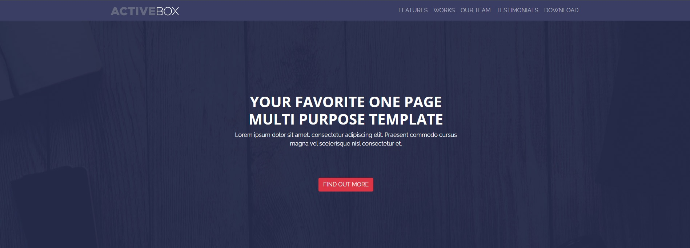
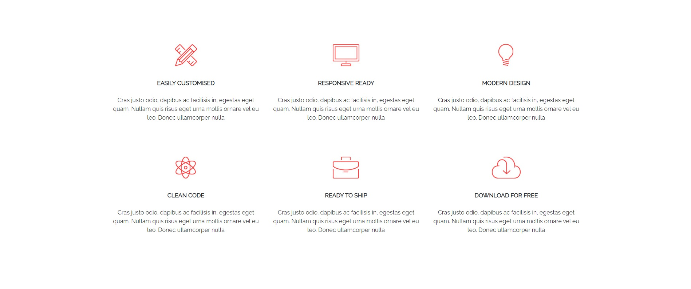
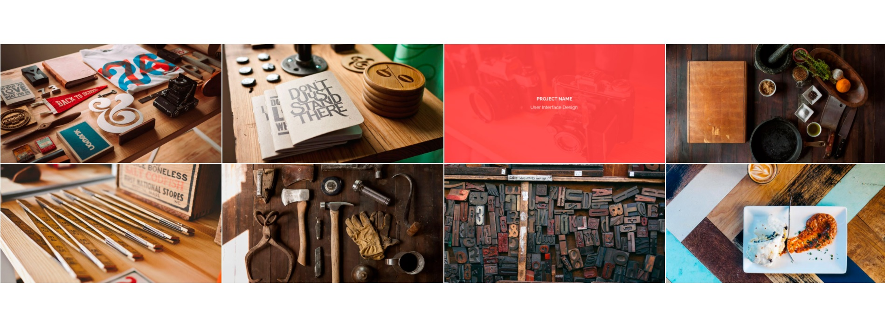
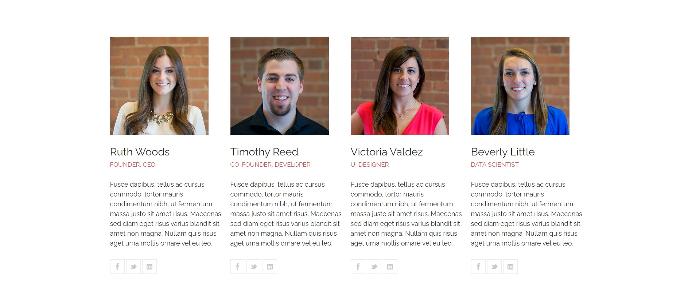
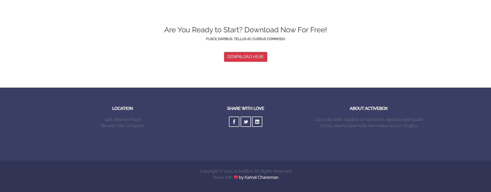

# Challenge - Frontend Developer Iniciante 

# Sobre o projeto

O projeto é uma landing page construída durante o processo de testes para recrutamento, organizado pela [Field Control](https://fieldcontrol.com.br/).

A página web consiste em um template para diversos tipos de negócios, onde a pessoa poderá apresentar produtos e serviços, através de sessões de funcionalidades, imagens, time de colaboradores, depoimentos de clientes e entre outros.

## Layout web
<p>
  
  
  
  
  
  
</p>

# Tecnologias utilizadas
## Front end
- HTML
- CSS
- Bootstrap

# Como executar o projeto

```bash
# clonar repositório
git clone https://github.com/brunobiasi/valinor.git

# entrar na pasta do projeto
cd public

# executar o projeto
start index.html
```