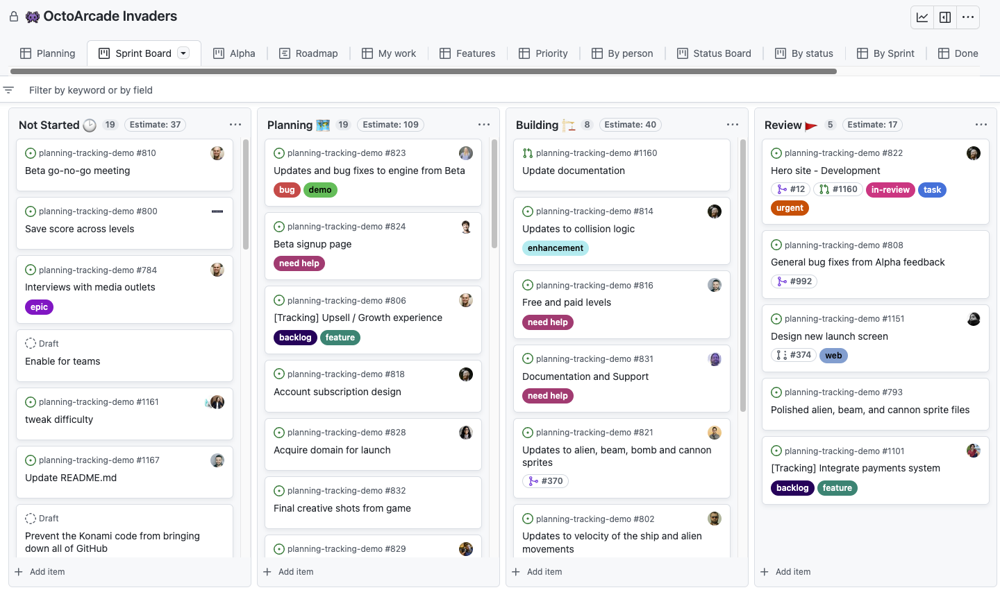

# Desafio Fieldflow - Modo Kanban

Olá candidato(a),

Este desafio será uma oportunidade empolgante para você demonstrar suas habilidades de desenvolvimento! Estamos animados para ver como você lidará com este desafio e a qualidade da sua solução. Vamos mergulhar no desenvolvimento de uma aplicação de gerenciamento de fluxo de trabalho com um kanban, semelhante ao GitHub Projects.

## Objetivo

O objetivo deste projeto é desenvolver uma aplicação "clone" do GitHub Projects, com funcionalidades que permitam aos usuários gerenciar tarefas em um kanban com colunas configuráveis.

> [!TIP]
> Uma dica para entender um pouco de como realizar esse desafio é explorar o github projects pelo seu proprio github, [Github Projects - Quick Start](https://docs.github.com/en/issues/planning-and-tracking-with-projects/learning-about-projects/quickstart-for-projects)

## Requisitos

A aplicação deve atender aos seguintes requisitos:

### Frontend

- **Gerenciamento de Colunas**

  - Permitir a criação de novas colunas.
  - Possibilitar a edição do nome de uma coluna existente.

- **Gerenciamento de Tarefas**

  - Capacidade de adicionar novas tarefas a uma coluna.
  - Permitir a edição do nome de uma tarefa existente.
  - Opção para arquivar ou excluir uma tarefa.

- **Funcionalidades Essenciais**
  - Capacidade de mover uma tarefa de uma coluna para outra.
  - Permitir a reordenação das colunas.
  - Opção para filtrar tarefas por nome.

### Backend

- **Persistência de Dados**

  - Preparar o backend para persistir as alterações feitas no frontend.

- **Operações CRUD**

  - Implementar operações CRUD (Create, Read, Update, Delete) para manipulação das tarefas.

- **Comunicação Frontend-Backend**
  - Permitir que o frontend se comunique com o backend para realizar operações necessárias.

## Tecnologias Recomendadas

### Node version

- **NodeJS:** versão 18

### Frontend

- **Framework:** Angular 17
- **Estilização:** Utilizar CSS, SASS ou Styled Components para estilização.

### Backend

- **Tecnologia:** NestJS
- **Banco de Dados:** Utilizar PostgreSQL, MySQL, MongoDB, ou outra opção conforme preferência.

## Critérios de Avaliação

Os candidatos serão avaliados com base nos seguintes critérios:

- **Adesão aos Requisitos:** Cumprimento dos requisitos especificados.
- **Qualidade do Código:** Código legível, seguindo boas práticas e modularidade.
- **Funcionalidades Corretas:** Garantia de funcionamento correto de todas as funcionalidades.
- **Resolução de Problemas:** Habilidade para resolver problemas e tomar decisões de design.
- **Comunicação Eficaz:** Clareza na comunicação das decisões de design e implementação.

## Prazo

Os candidatos têm até [inserir data aqui] para concluir o teste e enviar o pull request.

---

Esperamos que este desafio seja empolgante e aguardamos sua contribuição! Se tiver alguma dúvida ou precisar de mais informações, por favor, não hesite em entrar em contato. Boa sorte!
