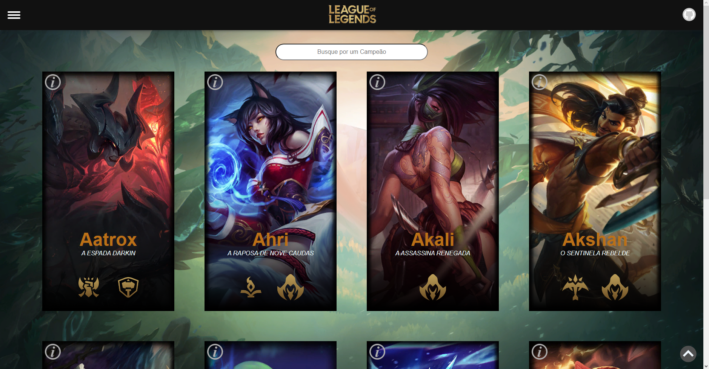
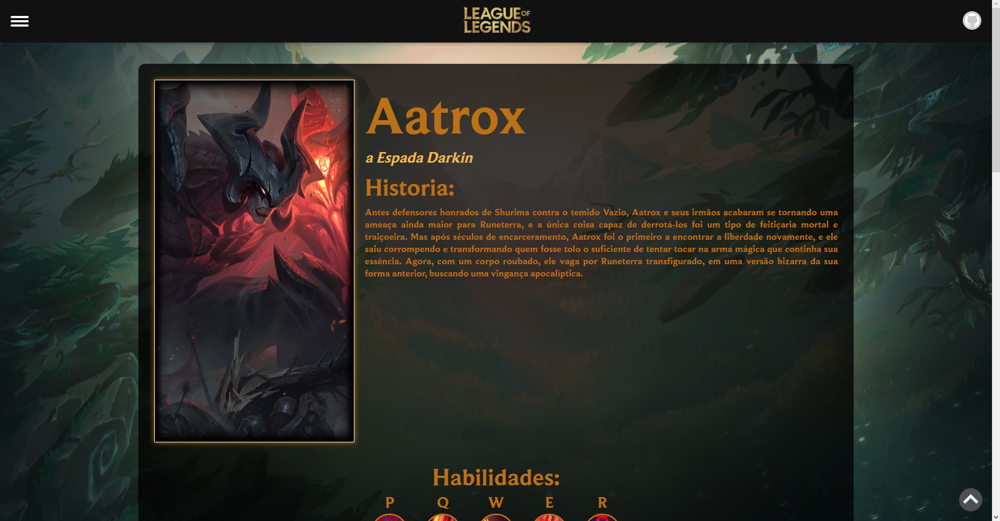
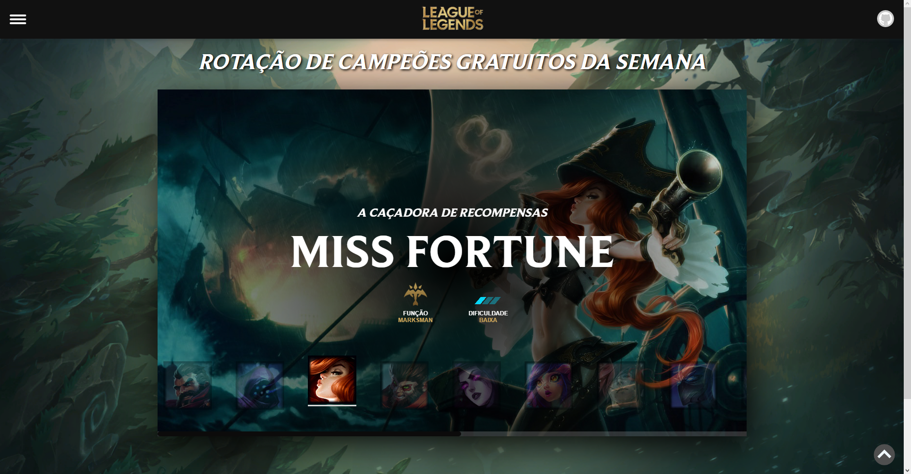
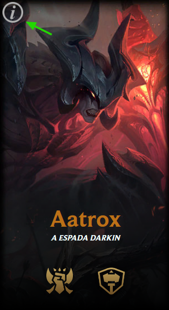

<h1 align="center">The Valinor</h1>
<br>

<h2><b>Sumário</b></h2>

   * [Sobre o Projeto](#sobreprojeto)
   * [Telas](#telas)
   * [Como iniciar o projeto](#iniciar-projeto)   
   * [Principais telas](#telas)
   * [Principais Botões](#botões)
   * [Principais Tecnologias](#tecnologias)
   * [Principio de Desenvolvimento](#desenvolvimento)
   * [Porque o Angular?](#porque)
   * [Desafios e problemas](#desafios)
   * [Melhorias](#melhorias)
   * [Sobre](#sobre)    


<h2 align="center">⚠Atenção⚠</h2>
<h3>Antes de tudo, atualize a Key para requisição, infelizmente ela tem validade de 24hrs e não consegui uma personalizada para a riot, agradeço a compreenção<br>Chave Atualizada:'RGAPI-80e1ce29-115d-4d87-b054-c8a1a3bac65f'</h3>


<h2 id="sobreprojeto">Sobre o Projeto</h2>
<p>Esse projeto é um desafio proposto pela FieldContol no qual devemos criar uma SPA utilizando um framework, nesse caso optei pelo Angular</p>
Nessa aplicação você terá acesso a funcionalidades como: 


* listagem de campeões
* informações detalhadas de cada campeão: nome, habilidades, skin, etc.
* rotação semanal gratuita de campeões 
* pesquisa por jogadores

Bom Aproveito! 😁

<br>
<h2 id="iniciar-projeto"><br>
  Iniciando o projeto
</h2>

- instale as dependencias: ```npm install```
- para executar no CLI: ```ng serve```
- Agora bastar copiar e colar a URL no seu navegador e ser feliz: ```http://localhost:4200/```

<p>ou se preferir, é só acessar: <b>https://valinor-beta.vercel.app</b></p>

<h2 id="telas">Principais tela</h2>

<div align="center">
  
<h3>Pagina Inicial</h3>
<p>
  
</p>

<h3>Detalhes de Campões</h3>
<p>
  
</p>

<h3>Rotação Semanal Campeões Gratuitos</h3>
<p>
  
</p>

<h3>Pesquisa por Jogadores</h3>
<p>
  
</p>

</div>
<h2 id="botões">Principais Botões</h2>
<div align="center">
<h3>Acesso das paginas</h3>
<p>
  
</p>

<h3>Detalhe dos campeões</h3>
<p>
  
</p>
</div>

<h2 id="tecnologias">Principais Tecnologias</h2>
<div align="center" gap="20px">
  
  
  
</div> 

<h2 id="desenvolvimento" >Principio de Desenvolvimento</h2>
<div align="center">
<h3>O famoso KISS 'Keep It Simple, but Sensational'</h3>
<p>
  
</p>
</div> 
  
<h2 id="porque">Porque o Angular?</h2>
<p align="left">Devido ao FieldAcademy, fui apresentado ao Angular, e foi amor a primeira vista, adorei a praticidade, achei um framework robusto, e sensacional de trabalhar, apesar desse ser literalmente o primeiro projeto Angular que eu inicio, já foi o suficiente para me conquistar, principalmente pelo facilidade na organização do projeto.<br> 
OBS: Eu optei por criar um json-server por conta de não constar na documentação da API utilizada, como é feita a paginação, ou pelo menos eu não achei :)  
</p>  
  
<h2 id="desafios">Desafios e problemas</h2>
<p align="left">
Como eu disse, esse é primeiro projeto Angular, até "ontem" não fazia ideia do que se tratava, mas achei 
bem tranquilo, talvez se eu já soubese algumas funcionalidades no começo, teria economizado muito tempo e esforço, porém na parte dos teste, eu tive bastante dificuldade, arrisquei nos teste unitários e 
apesar de funcionando corretamente a aplicação 1 dos teste segue falhando, acredito que sejá erro na hora de criar o teste realmente, justamente por conta dessa obstaculo que enfrentei, já estou tratando de estudar teste, poís reconheco a importância
</p>  
  
<h2 id="melhorias">Melhorias</h2>
<p align="left">
Acredito que quase sempre da pra melhorar, e essa aplicação não é diferente 
<br>
<br>
CSS: com certeza, apesar de tentar ao maximo deixar os codigos limpos, na parte do css eu me perdi um pouco. 
<br>
<br>
Testes: Com certeza, a adições de teste mais intregos e bem feitos seriam bem vindas.
<br>
<br>
Segurança: Como não pensei em nada relacionado a segurança da aplicação e sei da importancia, acredito que essa parte merece uma atenção especial
</p>

<h2 id="sobre">Sobre</h2>
<p>
Olá, me chamo Pedro Augusto, tenho 20 anos, sou estudante de ADS pela UNIP Rio Preto, apaixonado por tecnologia, e tenho uma relação de amor e ódio com o Lolzinho, por isso optei pela API da riot, a principio ia usar ela para fazer minha primeira requisição HTTP no angular e ops fiz o Valinor kkkkk.<br>
Gostaria de aproveitar para falar o quanto o projeto Field Academy, foi algo de outro mundo pra mim, sinceramente, não esperava evoluir tanto como pessoa e principalmente como dev, Obrigado <a target="_blank" href="https://github.com/FieldControl ">Field</a> e Obrigado <a href="https://github.com/guilhermeviinii" target="_blank">Gui</a> ❤<br>
Reconheço que tem muito a melhorar ainda nesse projeto, e não pretendo abandonalo, pois sinto que ainda posso aprender muito mais com ele, e espero que ele me ajude a conseguir minha primeira oportunidade como desenvolvedor, que já busco a um tempo.
  
</p>

<h2>Contato</h2>
<p align="left">
<a href="mailto:pedro.augusto.ipolto@hotmail.com"></a>

</p>
<p>
  <a href="https://www.linkedin.com/in/offpedroroseiro/"></a>
</p>
