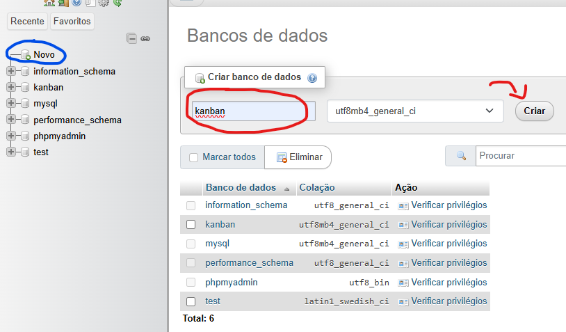
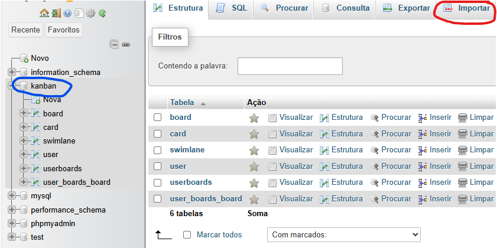
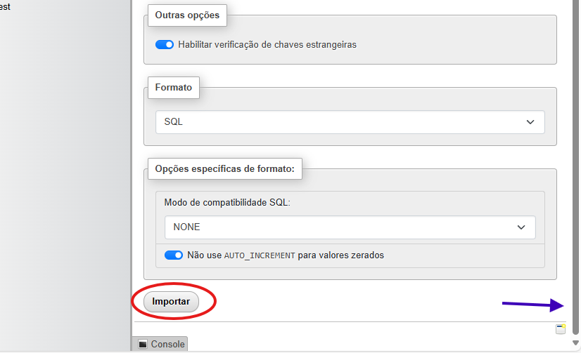

<h1 align="center"> Desafio-kanban </h1>
 
 

---

<h3>Descrição:</h3>

Este projeto é uma aplicação Kanban criada para ajudar na organização de tarefas de forma prática e visual. Usando TypeScript como base e os frameworks NestJS e Angular, o sistema oferece uma interface amigável e fácil de usar. Nele, você pode adicionar, editar e mover cartões entre colunas, mantendo tudo bem organizado. Com NestJS no backend e Angular no frontend, o projeto é robusto e escalável, pensado para proporcionar uma experiência fluida e eficiente.

<a href="#instalacao"> Instalações necessárias </a>
<a href="#dependencias"> Dependencias  </a>
<a href="#BD"> Importação do banco de dados  </a>
<a href="#BDportas"> portas para a vizualização  </a>
<a href="#rodar"> como rodar o projeto  </a>
<a href="#testes"> Testes do projeto  </a>
<a href="#credito"> Créditos  </a>

 
 

---

<h3 id="instalacao">Instalações necessárias:</h3>

Para o desenvolvimento do projeto, utilizamos o XAMPP v3.3.0 para gerenciar a conexão com o banco de dados, o Visual Studio Code v1.95.1 como editor de código, o node.js v20.18.0, o framework Angular v18.2.11 e qualquer navegador que permita acessar o phpMyAdmin para a demonstração do software.

<h4>instalações:<h4>
 <a href='https://www.apachefriends.org/index.html'>Instalação XAMPP</a> 
 <a href='https://nodejs.org/en/download/prebuilt-installer'>Instalação Node.js</a> 
 <a href='https://angular.dev/installation'>Instalação do framework Angular</a> 
 <a href='https://code.visualstudio.com/'>Instalação Visual Studio Code</a>  
 <a href='http://localhost/phpmyadmin'>Utilize apenas quando iniciar o XAMPP</a> 

  
  

--- 

<h3 id="dependencias">Dependencias:</h3>

As dependências são fundamentais para o funcionamento do projeto desafio-kanban. Por isso, irei listar as dependências necessárias para os arquivos tanto do frontend quanto do backend:

<h4>Backend:<h4>
Node.js v20.18.0  
Angular v18.2.11  
npm (Node Package Manager)  
typeorm  
bcrypt  
@types/bcrypt  
mysql2  
@nestjs/typeorm  
@nestjs/common  
@nestjs/core  
@nestjs/mapped-types  
@nestjs/platform-express  
@nestjs/jwt  

<h4>Frontend:<h4>
@angular/material  
@angular/cdk  
jwt-decode  

 
 

---

<h3 id="BD">Importação do banco de dados:</h3>

Para que a conexão com o banco de dados de certo, siga os passos abaixo:

Observe se o seu painel de controle está com o Apache e Mysql funcionando, eles estarão da mesma forma que a imagem demonstra. Logo após a verificação, clique em admin.

você irá ser direcionado a uma tela parecida com essa clicando em "novo". Logo após isso, de o nome ao seu banco de dados de "kanban" como acima e clique no botão criar.

Ao criar o "kanban" utilize o atalho ctrl + r para recarregar o navegador e clique em cima do kanban, marcado com a bolinha azul. Posteriormente clique em "Importar" presente no círculo vermelho.

Logo após o passo anterior, utilize a scrollbar apontada pela seta azul para descer ao final da página. Ao descer será possível vizualizar o botão importar, clique nele.

 
 

---

<h3 id="BDportas">portas para a vizualização:</h3>

As portas do XAMPP utilizadas para verificar o layout e o funcionamento do código foram:  
Backend:
URL: http://localhost:3000/ 
Frontend:
URL: http://localhost:4200/  

 
 

---

<h3 id="rodar">Como rodar o projeto:</h3>

Para rodar os arquivos será necessário abrir o terminal do Visual Studio Code e colocar estes códigos:

<h4>Backend:<h4>

para desenvolvimento: <strong>npm run start </strong>  
para modo de observação: <strong>npm run start:dev </strong>  
Para modo de produto: <strong>npm run start:prod </strong>

<h4>Fontend:<h4>
para desenvolvimento: <strong>ng build </strong>  
para observação do arquivo: <strong>ng serve</strong>

 
 

---

<h3 id="testes">Testes do projeto:</h3>

Para rodar os testes arquivos será necessário abrir o terminal do Visual Studio Code e colocar estes códigos:

<h4>Backend:<h4>

testes unitários: <strong>npm run test </strong>  
e2e testes: <strong>npm run test:e2e </strong>  
teste de covarade: <strong>npm run test:cov</strong>

<h4>Fontend:<h4>
testes unitários: <strong>ng test </strong>
 
 

---

<h3 id="credito">Créditos:</h3>

Esse projeto foi baseado no repósitorio desse autor: DevBySeb. 
Caso queiram mais informações é só seguir o link: https://github.com/DevBySeb/kanband-board 

 
 

---

 
<h4 align="center">Projeto desafio-Kanban Em construção... </h4>
<h4 align="center">Made with Laura <a href='https://www.linkedin.com/in/laura-fonte-3a85a7312/'>LinkedIn</a></h4>