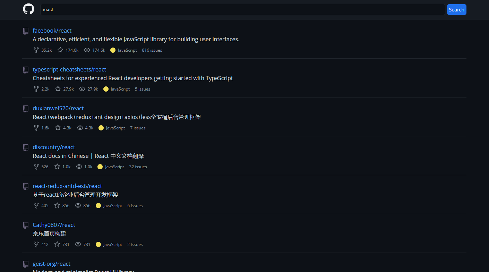

## Github Repos

Deploy: [Github Repos](https://zen-cray-536a22.netlify.app/)

## Instalação e configuração.

Faça um clone desse repositório. Tenha instalado `npm` e `node` na sua máquina.

Instalação:

`npm install`

Para iniciar o servidor:

`npm start`

Para rodar os testes:

`npm run test`

## Tecnologias utilizadas

- [GithubApi](https://developer.github.com/v3/search/)
- [ReactJS](https://pt-br.reactjs.org/)
- [React icons](https://react-icons.github.io/react-icons/)
- [Styled Components](https://styled-components.com/)
- [axios](https://github.com/axios/axios)
- [react-router](https://reactrouter.com/)
- [react-testing-library](https://testing-library.com/docs/react-testing-library/intro/)
