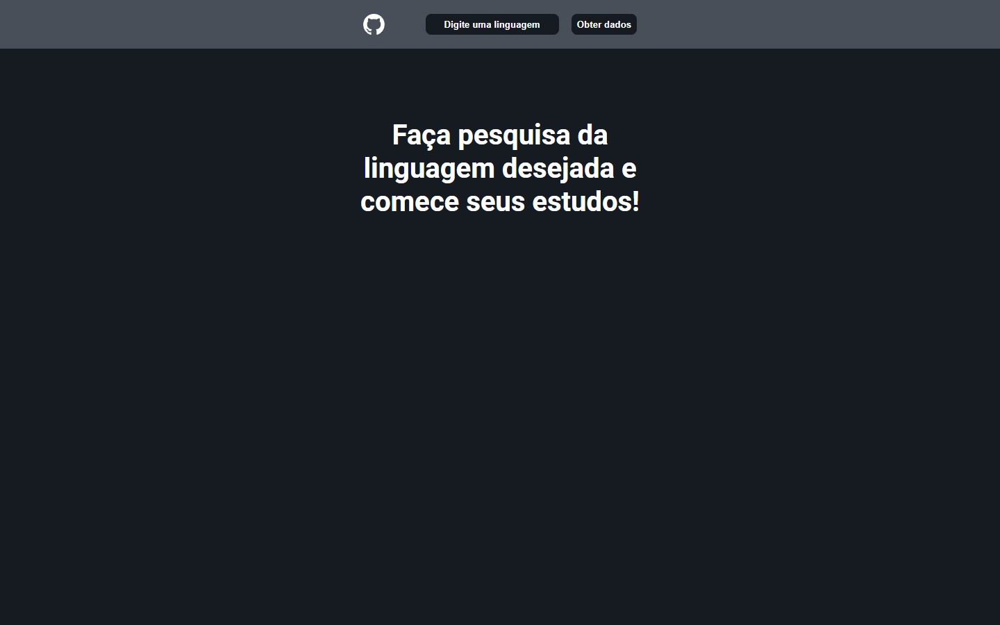
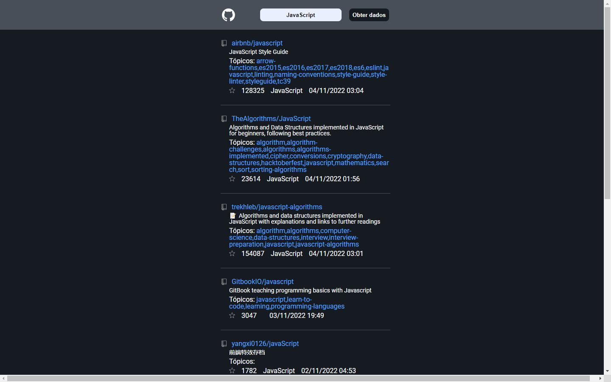
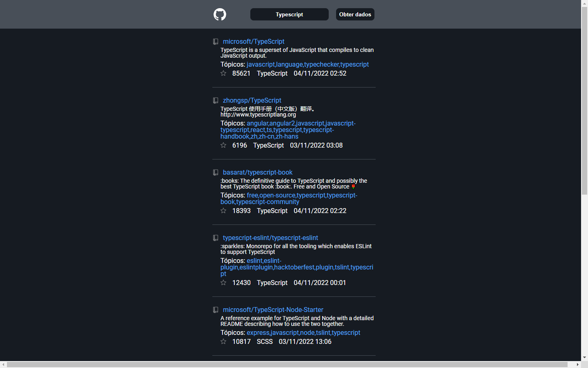
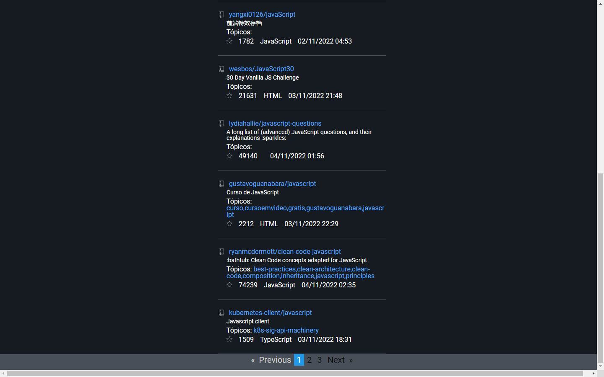

<p align="center">
  <a href="#-layout">Layout</a> •
  <a href="#-technologies">Technologies</a> •
  <a href="#-getting-started">Getting started</a>
</p>

## :framed_picture: Imagens

<div align="center">
    
    
    
    
    </div>
</div>

## 🔖 About this project

The project was a challenge to develop an application in Angular, bringing an Api informations as a list and putting pagination to improve the user's navigation.

## 🚀 Technologies

- [Angular](https://angular.io/)
- [TypeScript](https://www.typescriptlang.org/)
- [Ngx-Pagination](http://michaelbromley.github.io/ngx-pagination/#/)

## 💻 Getting started

### Requirements

- [Node.js](https://nodejs.org/en/)
- [Yarn](https://classic.yarnpkg.com/) or [npm](https://www.npmjs.com/package/npm)

**Access the submodule**

- [desafio-field-control](https://github.com/Baluress/desafio-field-control.git)

**Clone the project and access the folder**

```bash
git clone https://github.com/Baluress/desafio-field-control.git && cd desafio-field-control
```

**Follow the steps below**

### Server

```bash
# From the project root folder access the 'server' folder
$ cd desafio-field-control

# Install the dependencies
$ npm install

# Start the server
$ ng serve

```

### Navigate

Navigate to `http://localhost:4200/`

---

<p align="center">
  Made by Paulo Vicente with 💜
</p>
