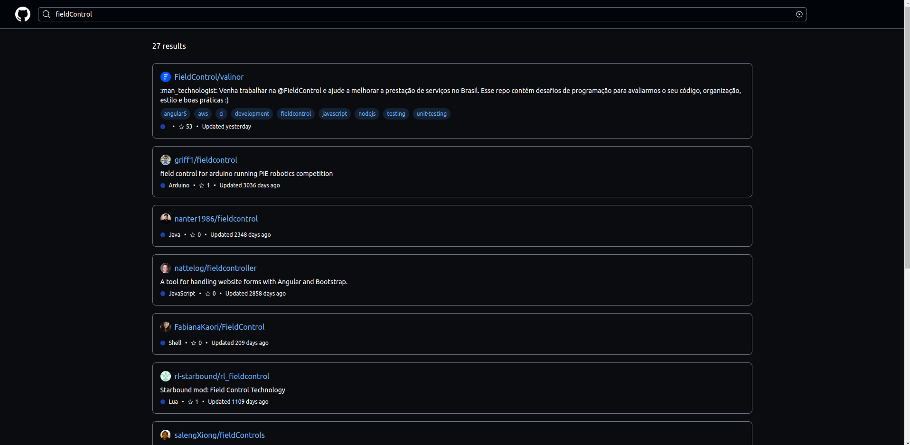
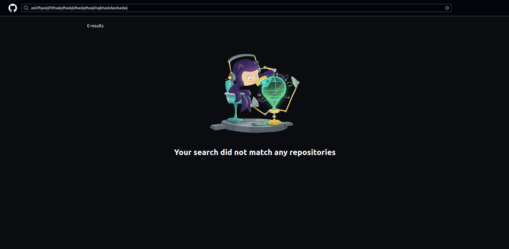
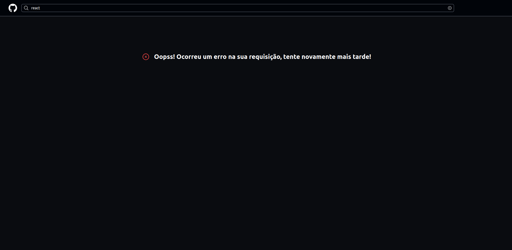

# Field Control Github Teste

Projeto de teste de código utilizando Angular + Tailwind consumindo a API do github para buscar repositórios

## Como rodar o projeto

  ```
   $ git clone https://github.com/zkauansantos/valinor.git

   $ cd valinor

   $ git checkout -b test-kauan

   $ yarn install ou npm install

   $ ng serve

  ```
  e pronto já poderá ver rodando localmente em sua máquina em http:localhost:4200 

## Rodando testes unitários

```
  $ ng test
```

## Layout 

### Home

[]()

### Results

[]()

### Empty

[]()
### Error

[]()


## Tecnologias Utilizadas

Utilizei Angular por ser a preferência do teste juntamente com tailwind para estilização pela rapidez e fluídez que ele traz no desenvolvimento


**Melhorias e próximas implementações**

- Pode ser feito a busca das issues dos repositórios
- Filtro por estrelas
- Filtro por mais recentes
- Buscas por outros endpoints do github


**Sobre você**

Me chamo Kauan, tenho 20 anos. Moro em Brasília nasci e cresci aqui! Tive a inspiração de desenvolver por um coordenador no ensino médio que me indicou conhecer a área e desde então me apaixonei, até então vim estudando dia após dia, mais especificamente front-end com ReactJs, tenho experiência com tecnologias como Node, Typescript, React, React Native, e no momento venho trabalhando com Angular à uns 5-6 meses  em um app de Streaming, e também venho fazendo freelances com React e Next. Apesar de pouco tempo no Angular me sinto confiante pra trabalhar pois tenho uma base sólida em javascript e o conhecimento e experiencia com React à mais de um ano me ajudou a aprender Angular rapidamente!  


email: kauansantosdepontes@gmail.com <br/>
phone: (61) 98255-2480
