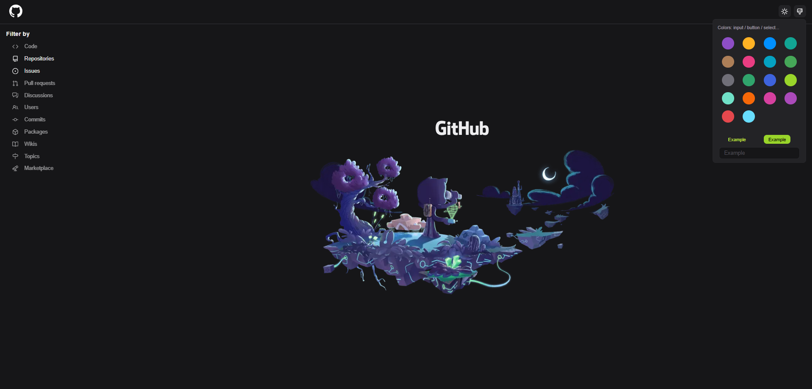
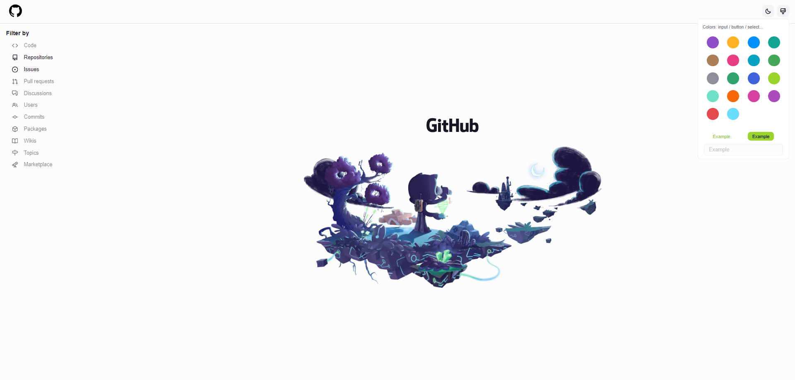
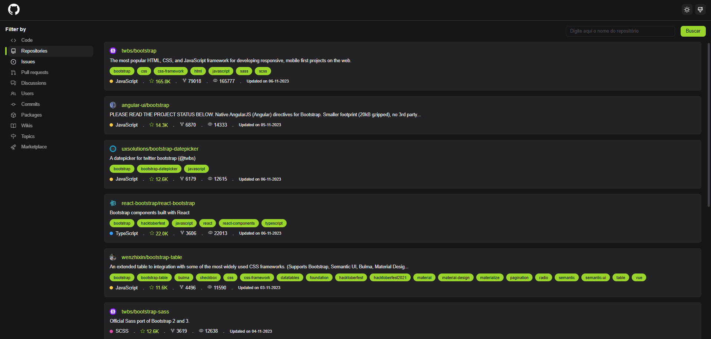
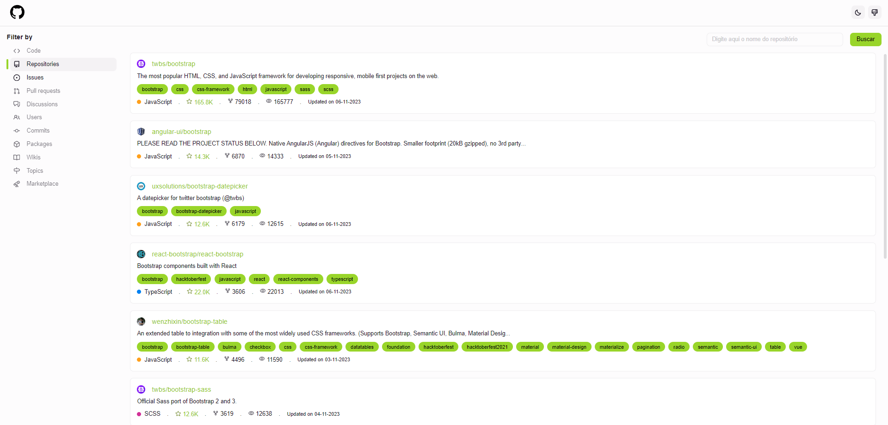
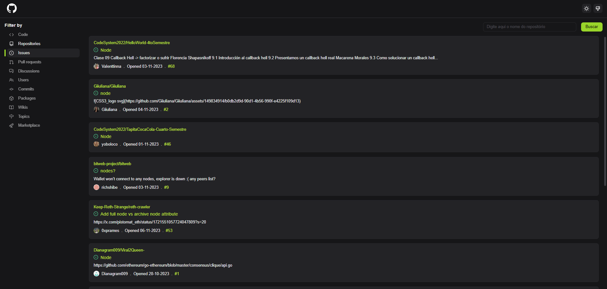
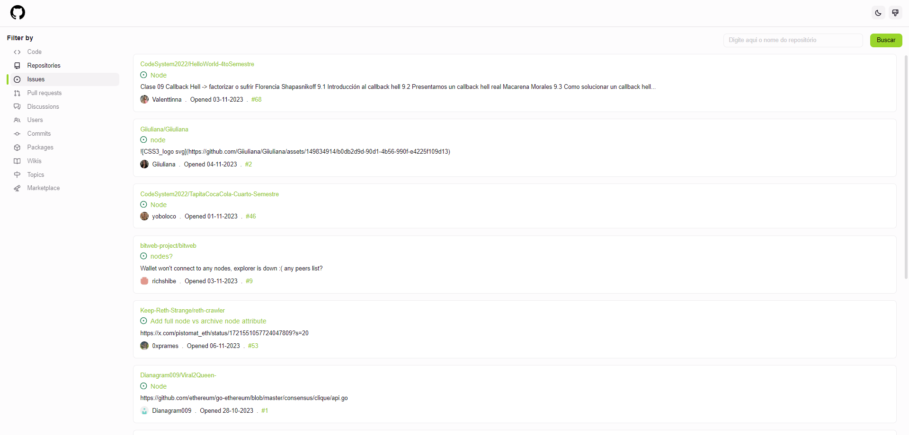
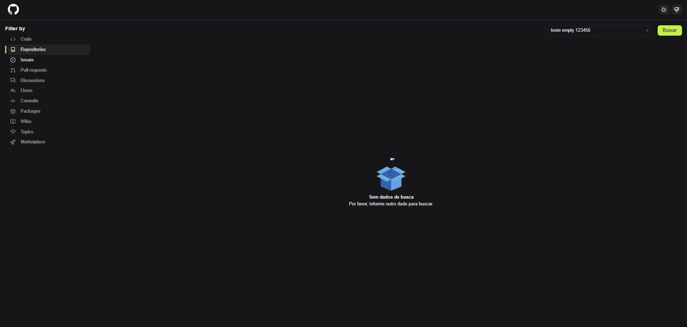
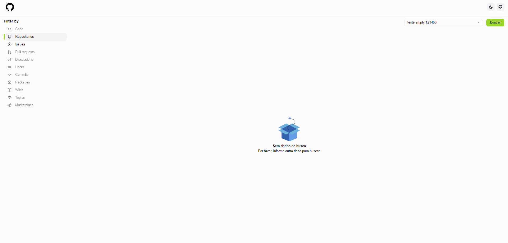

# Desafio: Frontend Developer

Email: paulosaudeanimall@gmail.com

Telefone: (17) 99729-0192

Paulo Eduardo Teixeira de Souza

Projeto: https://challenger-frontend.vercel.app/


## Entrega

- ### Qual ferramentas e bibliotecas (libraries, framework, tools etc) você usou? && Porque você optou pela tecnologia X e não a Y?


#### - Foi utilizado o Yarn como gerenciador de pacotes, por conta do desempenho, o Yarn é conhecido por ser mais rápido que o npm em operações como instalação de pacotes, e os comandos e interface do Yarn são mais intuitivos e fáceis de usar, dentre outro fatores.

#### - O React.js e o TypeScript foram escolhidos para a criação do projeto devido à familiaridade com o framework React e à facilidade de programação que o TypeScript oferece. O uso do React.js proporciona uma base sólida para o desenvolvimento de interfaces de usuário, enquanto o TypeScript adiciona benefícios significativos em termos de tipagem estática, ajudando a prevenir erros comuns e a melhorar a qualidade do código.

#### - Para consumir a API do GitHub foi utilizado o Axios porque ele é uma biblioteca JavaScript amplamente adotada para fazer requisições HTTP a servidores externos de forma simples e eficaz. O Axios fornece uma sintaxe clara e uma série de recursos que facilitam a realização de solicitações GET, POST e outras operações HTTP, tornando-o uma escolha popular para interagir com APIs, como a API do GitHub, em projetos React.js.

#### - Na criação dos componentes foi utilizado o Siakit porque ele é um conjunto de ferramentas e componentes reutilizáveis especialmente projetados para facilitar o desenvolvimento em React.js. O Siakit oferece uma variedade de componentes pré-construídos, estilos consistentes e recursos que aceleram o processo de criação de interfaces de usuário atraentes e responsivas. Além disso, o Siakit é altamente customizável, o que permite adaptar facilmente os componentes à identidade visual e às necessidades específicas do projeto, tornando-o uma escolha conveniente para agilizar o desenvolvimento de componentes em aplicações React.js, e também pelo fato de eu ter participado da criação dessa lib open source.

#### - Para a realização dos testes end-to-end (e2e), optei pela escolha do Cypress porque ele é uma ferramenta de automação de testes muito poderosa e fácil de usar. O Cypress oferece uma interface amigável que permite a criação rápida de testes e2e, além de fornecer uma experiência de depuração eficaz, tornando a identificação e resolução de problemas mais simples. Além disso, o Cypress é especialmente adequado para aplicativos baseados em React.js, proporcionando integração e suporte robustos para testes de aplicações web modernas. Sua capacidade de realizar testes em tempo real enquanto a aplicação é executada torna-o uma escolha conveniente para garantir a qualidade e confiabilidade do projeto.

#### - Além disso, foram incorporadas outras bibliotecas no projeto, como o date-fns para formatação de datas, phosphoricons para ícones e lottie para incluir animações.

- ### Quais princípios da engenharia de software que você usou?

#### - O princípio de engenharia de software que escolhi foi a organização modular do código. Optei por estruturar o projeto em pastas distintas, como 'components', 'pages', 'services' e 'utils', seguindo boas práticas amplamente recomendadas. Essa abordagem permite uma clara separação de responsabilidades, melhor legibilidade do código e facilita a manutenção e expansão do aplicativo, seguindo os princípios fundamentais de engenharia de software.

- ### Desafios e problemas que você enfrentou e como você resolveu?

#### - O maior desafio enfrentado foi o gerenciamento do tempo para alinhar o projeto com a visão desejada, além das restrições impostas pelo limite de uso da API do GitHub.

- ### O que você entende que pode ser melhorado e como fazer isso?

#### - Acredito que melhorias contínuas são sempre bem-vindas. Uma dessas melhorias incluiria a adição de novas funcionalidades ao projeto, aproveitando a mesma API do GitHub. Outra seria a criação de mais componentes para evitar a repetição de código desnecessário e fortalecer a implementação de testes automatizados. Durante o projeto, consegui criar apenas dois testes, focando nas duas funções do menu SideBar desenvolvido, devido às restrições de tempo. No entanto, com a simplicidade do Cypress, seria possível expandir os testes para cobrir também outras partes, como a gestão de temas, entre outros.


## Instalação

Como iniciar

De um comando yarn para baixar todas a libs do package.json e atualizar todas as dependências do projeto.

```bash
  yarn
```
    
Iniciando o projeto FrontEnd

De um comando yarn dev para iniciar o projeto.

```bash
  yarn dev
```
    
Iniciando os testes e2e com cypress

```bash
  yarn cypress open
```
    
Para compilar o projeto

```bash
  yarn build
```
    


# Imagens

## Home Page Dark

## Home Page Light

## Repositories Dark

## Repositories Light

## Issues Dark

## Issues Light

## Empty Dark

## Empty Light



### Sobre mim

- Meu nome é Paulo Eduardo Teixeira de Souza, tenho 29 anos.
- Sou bacharelado em engenharia da computação pela UNIRP.
- Nasci em Mirassol, morei em Mirassolândia, atualmente moro em São José do Rio Preto a aproximadamente 4 anos.
- Trabalho com desenvolvimento Web já há alguns anos, porem hoje sou coordenador de uma empresa, faço toda a parte de programação em C++, software embarcado e a criação de hardwares para carregadores de carro elétrico, com sistema de cobrança via MQTT e ws.
- Tenho conhecimento em "GraphQL, GitHub, GitLab, Git, Node.js, API REST, HTML, CSS, Python, C++, React.js, JavaScript, TypeScript, C# - tive contato na faculdade, Scrum, Metodologias Ageis, React Hooks, Hardwares".
- Comecei a trabalhar muito cedo, e sempre fui fascinado pela tecnologia, buscando entender como tudo funciona, como foi criado ou até mesmo em soluções que possam de alguma maneira agregar e facilitar processos de outras pessoas.
- Gosto de estar em constante aprendizagem, pessoal e profissional e também de poder ajudar de alguma maneira outras pessoas com o meu conhecimento.
