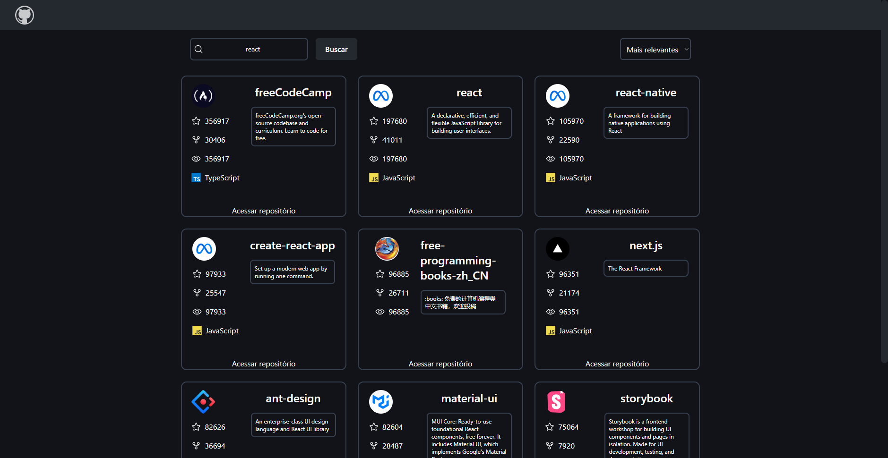

<div align="center">
  
  <h1 align="center">Github Search</h1>
 </div>
<p>Projeto desenvolvido para consumir a API do GitHub e mostrar os repositórios de acordo com a pesquisa do usuário.</p>

<br></br>
<h2>🚀 Começando</h2>
Essas instruções permitirão que você obtenha uma cópia do projeto em operação na sua máquina local para fins de desenvolvimento e teste.


<h2>🔧 Pré-requisitos</h2>
Para executar o projeto, você precisará ter instalado em sua máquina as seguintes ferramentas:

```
- NodeJs
- Git
```

<h2> Clonando o Repositório</h2>
Com o Git e o Node.js instalado na sua maquina e a URL do projeto em mãos, cria em algum lugar do seu pc uma pasta para criarmos uma copia do repositório, dentro dela abra o cmd ou powershell e digite os comandos abaixo:

```
- git clone https://github.com/PedroHenriqueGazola/Github-Search.git
- cd Github-Search
```

<h2>🔧 Instalação</h2>

Para instalar os requisitos do projeto, basta rodar o seguinte comando:

```
- npm install
```

Para rodar o programa em ambiente de desenvolvimento, basta rodar:

```
- npm run dev
```

Para buildar o programa, basta rodar:

```
- npm run build
```
<h2>🛠️ Construído com</h2>

* [Typescript](https://www.typescriptlang.org/docs) - Projeto realizado em Typescript.
* [React](https://pt-br.reactjs.org/docs/getting-started.html) - Biblioteca JavaScript para construção de interfaces de usuário.
* [Next](https://nextjs.org) - Framework React com finalidade de auxiliar na construção no projeto e implementação de novas funções.
* [Tailwind](https://tailwindcss.com) - Framework para a estilização do projeto.
* [Phosphor](https://phosphoricons.com) - Biblioteca de icones flexiveis.


<h2>📄 Licença</h2>
Este projeto está sob a licença MIT License - veja o arquivo LICENSE.md para detalhes.
