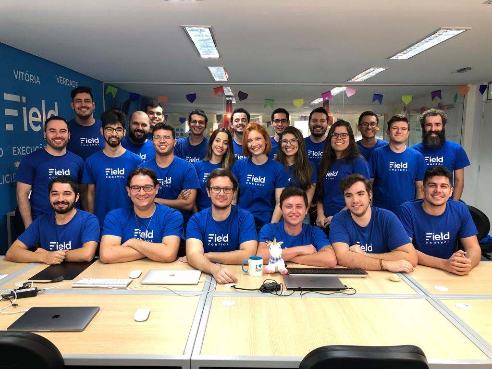

👨‍💻 Vaga para apaixonados por criação de software
===========================================

A empresa
----------

Somos um [SaaS (Software as a service)](https://pt.wikipedia.org/wiki/Software_como_servi%C3%A7o) para empresas que possuem prestadores de serviços externos.

Entregamos **controle**, **organização** e **melhor relacionamento com o cliente** para empresas de Climatização, Segurança eletrônica, Telecom, Provedores de internet, Montadoras de móveis, Empresas de limpeza, enfim, qualquer empresa que possui uma equipe de campo para realização de serviços.

Nossa missão é melhorar a prestação de serviços no Brasil.

Te convido a conhecer um pouco mais da Field e da nossa **cultura** pelo nosso instagram: [@FieldControl](https://www.instagram.com/fieldcontrol/)

<p>
  
</p>

Origem
----------

Um ponto importante é que a Field foi fundada por desenvolvedores, só por esse motivo você pode **TER CERTEZA** que aqui as coisas são muito diferentes das empresas tradicionais.

Aqui utilizamos [princípios ágeis](http://www.manifestoagil.com.br/) **DE VERDADE** para criação de software. Veja bem, não estou falando de post its ou reuniões em pé.. E sim de: Pair programming, Continuous Integration, Continuous Deployment e claro, testes automatizados.

Condições
----------
- Período: Integral
- Onde: Qualquer lugar :)
- Benefícios: Alimentação, Plano de saúde, Seguro de vida, [Pluralsight](https://www.pluralsight.com/), [Alura](https://www.alura.com.br/), [Amazon Books](https://www.amazon.com/books-used-books-textbooks/b?ie=UTF8&node=283155) <3

:house_with_garden: Você pode ler sobre nossa cidade no [G1](http://g1.globo.com/sao-paulo/sao-jose-do-rio-preto-aracatuba/especial-publicitario/prefeitura-de-rio-preto/rio-preto-noticias/noticia/2015/12/rio-preto-e-melhor-cidade-do-estado-e-segunda-do-pais-para-se-viver.html), [Infomoney](http://www.infomoney.com.br/minhas-financas/consumo/noticia/6391352/melhores-cidades-brasil-para-viver-veja-ranking) ou aqui na [Exame](https://exame.com/brasil/o-ranking-do-servico-publico-nas-100-maiores-cidades-do-brasil/).

Trabalhamos com uma boa infraestrutura, nosso hardware é muito bom (você vai ter um notebook f#d@ com ssd e dois monitores :computer: :computer:) e possuímos um ambiente de trabalho agradável:

<p float="left">
  
  
  
</p>

A empresa não possui hierarquias e você é convidado e desafiado a colaborar com todas as frentes de trabalho. Ou seja, aqui todas sugestões são bem vindas!

Ah, e quando a Field bate meta (quase sempre) o frigobar fica assim:

<p>
  
</p>

Queremos a cada dia mais flexibilidade e continuar animados a evoluir nossas aplicações.

Nosso trabalho é baseado em autogestão. Só existe uma regra de convivência: É proibido murmurar! Aqui as opiniões são discutidas, resolvidas e sempre chegamos a um consenso para melhorar a nossa convivência. Isso não foi descrito por um gerente de RH e sim por um desenvolvedor de software.

Oportunidade
----------

Estamos em busca de desenvolvedores **Frontend** FODAS e APAIXONADOS para fazer parte do nosso time de produto.

Na Field, o seu dia-a-dia será repleto de:

```javascript
[
  'GitHub & Git <3',
  'Muito, muito e muito JavaScript',
  'Object-oriented programming, SOLID Principles & Design Patterns',
  'Práticas e princípios ágeis (Pair programming, Continuous Integration, Continuous Deployment)',
  'Testes de software (unitários, integração, e2e..)',
  'Desafios de escalabilidade',
  'Desafios de alta disponibilidade',
  'Micro services e aplicações distribuídas',
  'Amazon Web Services',
  'PAAS & Cloud Services',
  'Serverless apps',
  'AngularJS, Angular',
  'REST APIs',
  'GraphQL APIs',
  'Material Design',
  'Open source software'
]
```

Nossa stack tecnológica é predominantemente JavaScript, abrangendo Node.js, Single Page Applications (SPA) e Hybrid Mobile Apps.

Acreditamos firmemente que excelentes desenvolvedores são capazes de selecionar a ferramenta mais adequada para cada desafio. Por essa razão, para resolver problemas específicos, recorremos às melhores alternativas disponíveis, o que nos leva a incluir uma pitada de C#, Java e PHP em nossas soluções.

Nossos servidores residem na AWS, onde utilizamos a nuvem como nossa plataforma principal. Temos aplicativos funcionando com Elastic BeanStalk, armazenamento em S3 e arquiteturas serverless com AWS Lambda.

Antes mesmo de avaliar o conhecimento técnico, valorizamos o perfil pessoal dos candidatos. Para nós, a determinação, o interesse e a curiosidade são qualidades essenciais. Se você é alguém proativo, interessado e que busca constantemente aprender, é isso que realmente importa para nós! 😊

---

## Requisitos Principais

🌟 **Sem Ego**: Acreditamos que ninguém é melhor que ninguém e que todos podem aprender uns com os outros. Promovemos um ambiente onde a humildade, o respeito e a abertura para aprender e ensinar são valorizados.

📈 **Evolução Contínua**: Encorajamos o crescimento pessoal e profissional de todos os membros da equipe. Estamos comprometidos em fornecer oportunidades de aprendizado e desenvolvimento, permitindo que cada indivíduo evolua constantemente em sua jornada.

🚀 **Proatividade**: Buscamos indivíduos proativos, capazes de antecipar problemas e buscar soluções de forma autônoma.

🔑 **Sentimento de Dono**: Valorizamos profissionais que assumem responsabilidade pelo seu trabalho e estão comprometidos com o sucesso do projeto como se fossem os donos.

🤝 **Boa Comunicação e Trabalho em Equipe**: Habilidades de comunicação eficaz e colaboração são essenciais para trabalhar de forma eficiente em equipe.

💻 **Proficiência em JavaScript e TypeScript**: Experiência sólida em JavaScript e TypeScript, demonstrando habilidade em desenvolver soluções robustas e escaláveis.

🎨 **Experiência com CSS e HTML Semântico**: Conhecimento prático em CSS e HTML Semântico para criar interfaces atraentes e acessíveis.

🔧 **Experiência Sólida com Angular e Ionic**: Capacidade comprovada no desenvolvimento com Angular e Ionic, demonstrando habilidade em construir aplicações web e mobile de alta qualidade.

🖌️ **Familiaridade com Princípios de UX**: Compreensão dos princípios de User Experience (UX) para criar interfaces intuitivas e amigáveis aos usuários.

🌐 **Familiaridade com APIs REST, GraphQL e WebSockets**: Conhecimento em APIs REST, GraphQL e WebSockets para comunicação eficiente entre cliente e servidor.

🧪 **Prática em Testar Software**: Experiência prática em testes de software, incluindo testes unitários, integrados e de aceitação, garantindo a qualidade e a confiabilidade do sistema.

Estes requisitos refletem nossa busca por profissionais qualificados e comprometidos, capazes de contribuir de forma significativa para o sucesso de nossos projetos.

O desafio de programação
----------

Se você é apaixonado por desenvolvimento de software e busca desafios para impulsionar sua carreira, este teste é para você! Realize o desafio abaixo e faça um fork deste repositório para começar a codificar. [Let the hacking begin](https://www.youtube.com/watch?v=Dvrdxn0kHL8)! 🚀

# 🎯 Valinor Kanban - Trello-like Application

A full-stack Kanban board application built with **Angular** (frontend), **NestJS** (backend), **Supabase** (database), and **GraphQL** for a modern, real-time collaborative experience.

## 🏗️ Architecture Overview

- **Frontend**: Angular 17 with standalone components, Angular Material, and reactive signals
- **Backend**: NestJS with GraphQL API and WebSocket for real-time updates
- **Database**: Supabase with Row Level Security (RLS)
- **Real-time**: Socket.io for live collaboration
- **Testing**: Unit and integration tests for both frontend and backend

## 📚 Key Features

✅ **Core Functionality**
- Create, edit, and delete boards
- Create, edit, and delete columns within boards
- Create, edit, and delete cards within columns
- Drag & drop cards between columns
- Drag & drop to reorder columns
- Real-time collaborative editing

✅ **Advanced Features**
- GraphQL API with type-safe operations
- WebSocket connections for live updates
- Responsive Material Design UI
- Position management with automatic reordering
- Color-coded cards with due dates
- Comprehensive error handling

✅ **Technical Excellence**
- Clean architecture with SOLID principles
- Type safety throughout the stack
- Comprehensive test coverage
- Docker containerization ready
- Environment-based configuration

## 🚀 Quick Start

### Prerequisites

- Node.js 18+
- npm 9+
- Supabase account

### 1. Clone and Install

```bash
git clone <repository-url>
cd valinor
npm run install:all
```

### 2. Database Setup

1. Create a new Supabase project at [supabase.com](https://supabase.com)
2. Copy your project URL and keys
3. Run the SQL schema in your Supabase SQL editor:

```sql
-- Execute the content from supabase-schema.sql
```

### 3. Environment Configuration

**Backend Environment** (`packages/backend/.env`):
```env
SUPABASE_URL=your_supabase_project_url
SUPABASE_ANON_KEY=your_supabase_anon_key
SUPABASE_SERVICE_ROLE_KEY=your_supabase_service_role_key
PORT=3000
NODE_ENV=development
CORS_ORIGIN=http://localhost:4200
```

**Frontend Environment** (`packages/frontend/src/environments/environment.ts`):
```typescript
export const environment = {
  production: false,
  apiUrl: 'http://localhost:3000/graphql',
  wsUrl: 'http://localhost:3000',
  supabaseUrl: 'your_supabase_project_url',
  supabaseAnonKey: 'your_supabase_anon_key'
};
```

### 4. Run the Application

```bash
# Install dependencies
npm run install:all

# Start both backend and frontend
npm run dev

# Or run them separately
npm run dev:backend  # http://localhost:3000
npm run dev:frontend # http://localhost:4200
```

### 5. Access the Application

- **Frontend**: http://localhost:4200
- **GraphQL Playground**: http://localhost:3000/graphql
- **Backend API**: http://localhost:3000

## 📁 Project Structure

```
valinor/
├── packages/
│   ├── backend/                 # NestJS Backend
│   │   ├── src/
│   │   │   ├── kanban/         # Kanban domain module
│   │   │   │   ├── dto/        # GraphQL DTOs
│   │   │   │   ├── services/   # Business logic
│   │   │   │   ├── resolvers/  # GraphQL resolvers
│   │   │   │   └── types/      # TypeScript interfaces
│   │   │   ├── supabase/       # Database integration
│   │   │   ├── realtime/       # WebSocket gateway
│   │   │   └── main.ts         # Application entry
│   │   └── package.json
│   └── frontend/               # Angular Frontend
│       ├── src/
│       │   ├── app/
│       │   │   ├── components/ # Angular components
│       │   │   ├── services/   # Angular services
│       │   │   └── models/     # TypeScript models
│       │   └── main.ts         # Application entry
│       └── package.json
├── supabase-schema.sql         # Database schema
└── package.json                # Root package.json
```

## 🔧 Development Guidelines

### Backend Development

The backend follows clean architecture principles:

- **Services**: Contain business logic and database operations
- **Resolvers**: Handle GraphQL queries and mutations
- **DTOs**: Define GraphQL schema and validation
- **Types**: TypeScript interfaces for type safety

### Frontend Development

The frontend uses modern Angular patterns:

- **Standalone Components**: No need for NgModules
- **Reactive Signals**: For state management
- **Angular Material**: For consistent UI components
- **Apollo Client**: For GraphQL operations

### Code Quality Standards

- **TypeScript**: Strict mode enabled
- **ESLint**: For code linting
- **Prettier**: For code formatting
- **Jest**: For unit testing
- **Clean Code**: Following SOLID principles

## 🧪 Testing

```bash
# Run all tests
npm run test

# Run backend tests
npm run test:backend

# Run frontend tests
npm run test:frontend

# Test coverage
npm run test:cov
```

## 📊 GraphQL API

### Queries

```graphql
# Get all boards
query GetBoards {
  boards {
    id
    title
    description
    columns {
      id
      title
      position
      cards {
        id
        title
        description
        position
        color
      }
    }
  }
}

# Get specific board
query GetBoard($id: ID!) {
  board(id: $id) {
    id
    title
    description
    columns {
      id
      title
      position
      cards {
        id
        title
        description
        position
        color
      }
    }
  }
}
```

### Mutations

```graphql
# Create board
mutation CreateBoard($input: CreateBoardInputDto!) {
  createBoard(input: $input) {
    id
    title
    description
  }
}

# Create column
mutation CreateColumn($input: CreateColumnInputDto!) {
  createColumn(input: $input) {
    id
    title
    position
  }
}

# Create card
mutation CreateCard($input: CreateCardInputDto!) {
  createCard(input: $input) {
    id
    title
    description
    position
    color
  }
}

# Move card
mutation MoveCard($input: MoveCardInputDto!) {
  moveCard(input: $input) {
    id
    column_id
    position
  }
}
```

## 🔄 Real-time Features

The application uses WebSocket connections for real-time collaboration:

- **Board Updates**: Live updates when boards are modified
- **Column Changes**: Real-time column additions, updates, and movements
- **Card Movements**: Live drag-and-drop synchronization
- **Multi-user Support**: Multiple users can collaborate simultaneously

## 🏷️ Database Schema

### Tables

1. **boards**: Board information
2. **columns**: Columns within boards
3. **cards**: Cards within columns

### Key Features

- **UUID Primary Keys**: For better performance and security
- **Position Management**: Automatic reordering of items
- **Cascading Deletes**: Clean up related data automatically
- **RLS Policies**: Row Level Security for access control
- **Automatic Timestamps**: Created and updated timestamps

## 🔐 Security Features

- **Row Level Security (RLS)**: Database-level access control
- **Input Validation**: Server-side validation with class-validator
- **CORS Configuration**: Secure cross-origin requests
- **Environment Variables**: Secure configuration management

## 🚀 Deployment

### Development

```bash
npm run dev
```

### Production Build

```bash
npm run build
```

### Docker Deployment

```dockerfile
# Example Dockerfile structure would be here
# Optimized for production deployment
```

## 🤝 Contributing

1. **Fork** the repository
2. **Create** a feature branch
3. **Commit** your changes
4. **Push** to the branch
5. **Open** a Pull Request

### Development Standards

- Follow the established coding standards
- Write comprehensive tests
- Update documentation
- Ensure type safety
- Follow clean code principles

## 📈 Performance Optimizations

- **Lazy Loading**: Components and modules
- **OnPush Change Detection**: Optimized Angular change detection
- **Database Indexing**: Optimized database queries
- **GraphQL Caching**: Apollo Client caching
- **Bundle Optimization**: Webpack optimizations

## 🛠️ Technologies Used

### Frontend
- **Angular 17**: Modern web framework
- **Angular Material**: UI component library
- **Apollo Client**: GraphQL client
- **Socket.io Client**: Real-time communication
- **RxJS**: Reactive programming
- **TypeScript**: Type-safe JavaScript

### Backend
- **NestJS**: Node.js framework
- **GraphQL**: API query language
- **Apollo Server**: GraphQL server
- **Socket.io**: WebSocket communication
- **Supabase**: Backend-as-a-service
- **class-validator**: Input validation

### Development Tools
- **ESLint**: Code linting
- **Prettier**: Code formatting
- **Jest**: Testing framework
- **Webpack**: Module bundler
- **Git**: Version control

## 📝 License

This project is licensed under the MIT License - see the LICENSE file for details.

## 📞 Support

For support, please open an issue in the GitHub repository or contact the development team.

---

**Built with ❤️ for the Field Control team challenge**

Dúvidas?
----------
Abra um issue ou me mande um e-mail em **luiz@fieldcontrol.com.br**, fechou? :)

Gostariamos de entender como você pensa e as decisões que você tomou durante o desenvolvimento. Então, quando for enviar seu pull request, por favor responda:

- Qual ferramentas e bibliotecas (libraries, framework, tools etc) você usou
- Porque você optou pela tecnologia X e não a Y
- Quais princípios da engenharia de software que você usou?
- Desafios e problemas que você enfrentou e como você resolveu
- O que você entende que pode ser melhorado e como fazer isso

# Valinor - Trello-like Kanban Board Application

A modern, real-time Kanban board application built with Angular, NestJS, GraphQL, and Supabase.


## 🚀 Features

- ✅ **Drag & Drop**: Intuitive drag-and-drop for cards and columns
- ✅ **Real-time Updates**: WebSocket support for collaborative editing
- ✅ **CRUD Operations**: Full create, read, update, delete for boards, columns, and cards
- ✅ **GraphQL API**: Type-safe API with GraphQL
- ✅ **Modern UI**: Material Design with smooth animations
- ✅ **Responsive**: Works on desktop and mobile devices
- ✅ **Keyboard Shortcuts**: Alt+B to navigate back to boards

## 🛠️ Tech Stack

- **Frontend**: Angular 17, Angular Material, Angular CDK
- **Backend**: NestJS, GraphQL, Socket.io
- **Database**: Supabase (PostgreSQL)
- **Language**: TypeScript
- **Styling**: SCSS, Material Design

## 📋 Prerequisites

- Node.js (v18 or higher)
- npm or yarn
- Supabase account (for database)
- Git

## 🏃‍♂️ Quick Start

### 1. Clone the repository
```bash
git clone https://github.com/yourusername/valinor.git
cd valinor
```

### 2. Install dependencies
```bash
# Install root dependencies
npm install

# Install frontend dependencies
cd packages/frontend
npm install

# Install backend dependencies
cd ../backend
npm install
```

### 3. Set up environment variables

Create a `.env` file in `packages/backend/` with your Supabase credentials:

```env
SUPABASE_URL=your_supabase_url
SUPABASE_ANON_KEY=your_supabase_anon_key
SUPABASE_SERVICE_ROLE_KEY=your_supabase_service_role_key
```

### 4. Set up the database

Apply the database schema to your Supabase project:

```sql
-- Run the contents of supabase-schema.sql in your Supabase SQL editor
```

### 5. Start the development servers

In separate terminals:

```bash
# Terminal 1 - Start backend (from packages/backend)
npm run start:dev

# Terminal 2 - Start frontend (from packages/frontend)  
npm start
```

### 6. Access the application

- Frontend: http://localhost:4200
- Backend GraphQL Playground: http://localhost:3000/graphql

## 📁 Project Structure

```
valinor/
├── packages/
│   ├── frontend/          # Angular application
│   │   ├── src/
│   │   │   ├── app/       # Application components and services
│   │   │   ├── assets/    # Static assets
│   │   │   └── environments/
│   │   └── angular.json   # Angular configuration
│   │
│   └── backend/           # NestJS application
│       ├── src/
│       │   ├── kanban/    # Kanban module (boards, columns, cards)
│       │   ├── realtime/  # WebSocket gateway
│       │   └── supabase/  # Supabase service
│       └── nest-cli.json  # NestJS configuration
│
├── supabase-schema.sql    # Database schema
├── README.md              # This file
├── SETUP.md               # Detailed setup instructions
└── package.json           # Root package.json for monorepo

```

## 🔧 Development

### Available Scripts

**Frontend (packages/frontend):**
- `npm start` - Start development server
- `npm run build` - Build for production
- `npm test` - Run unit tests

**Backend (packages/backend):**
- `npm run start:dev` - Start development server with watch mode
- `npm run build` - Build for production
- `npm test` - Run unit tests

### Key Features Implementation

#### Drag & Drop
- Implemented using Angular CDK Drag & Drop
- Supports both card and column reordering
- Visual feedback during drag operations

#### Real-time Updates
- WebSocket gateway using Socket.io
- Board-specific rooms for targeted updates

#### GraphQL API
- Type-safe queries and mutations
- Auto-generated schema from TypeScript decorators

## 🧪 Testing

```bash
# Run frontend tests
cd packages/frontend
npm test

# Run backend tests
cd packages/backend
npm test
```

## 📦 Building for Production

```bash
# Build frontend
cd packages/frontend
npm run build

# Build backend
cd packages/backend
npm run build
```

## 🚢 Deployment

The built applications can be deployed to various platforms:

- **Frontend**: Vercel, Netlify, AWS S3 + CloudFront
- **Backend**: Heroku, AWS ECS, Google Cloud Run
- **Database**: Supabase (managed)

## 🤝 Contributing

1. Fork the repository
2. Create your feature branch (`git checkout -b feature/amazing-feature`)
3. Commit your changes (`git commit -m 'Add some amazing feature'`)
4. Push to the branch (`git push origin feature/amazing-feature`)
5. Open a Pull Request

## 📝 License

This project is licensed under the MIT License.

## 🙏 Acknowledgments

- Field Control for the project requirements
- Angular and NestJS communities for excellent documentation
- Supabase for the fantastic BaaS platform

---

Made with ❤️ using Angular, NestJS, and Supabase
