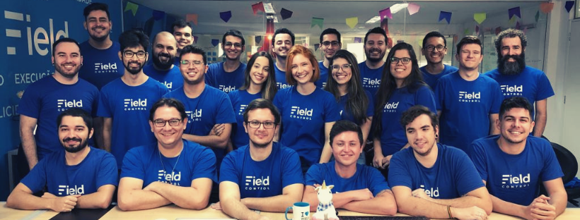
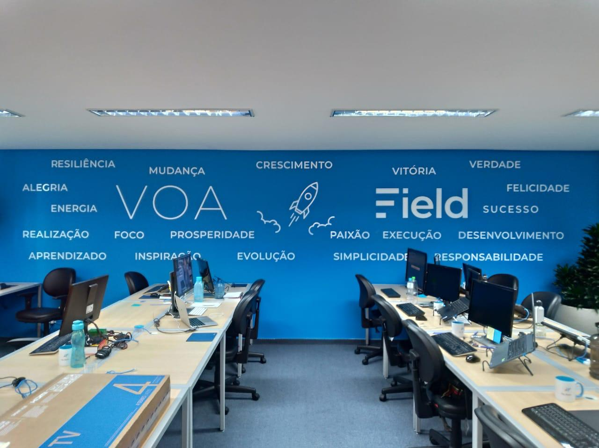
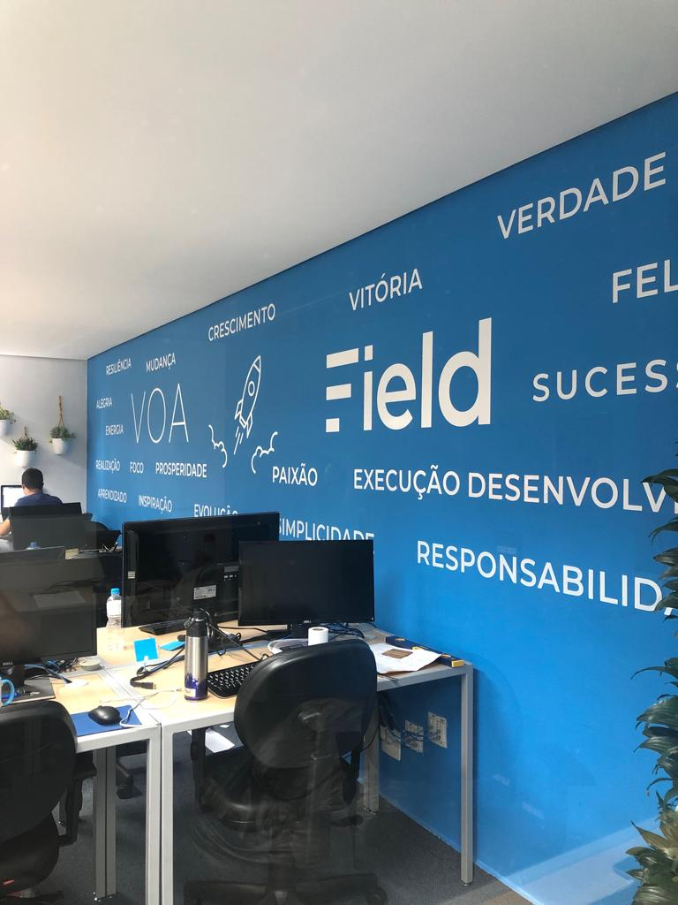
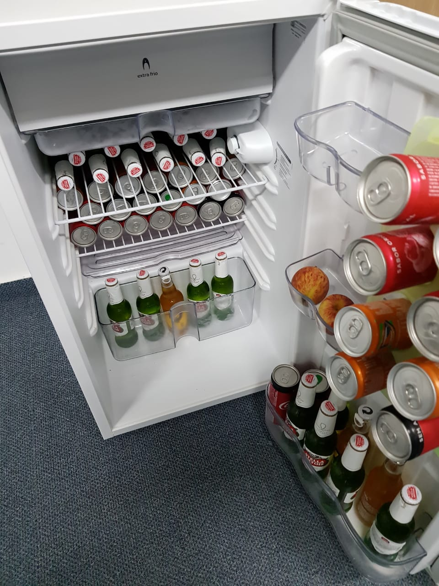

👨‍💻 Vaga para apaixonados por criação de software
===========================================

A empresa
----------

Somos um [SaaS (Software as a service)](https://pt.wikipedia.org/wiki/Software_como_servi%C3%A7o) para empresas que possuem prestadores de serviços externos. 

Entregamos **controle**, **organização** e **melhor relacionamento com o cliente** para empresas de Climatização, Segurança eletrônica, Telecom, Provedores de internet, Montadoras de móveis, Empresas de limpeza, enfim, qualquer empresa que possui uma equipe de campo para realização de serviços.

Nossa missão é melhorar a prestação de serviços no Brasil. 

Te convido a conhecer um pouco mais da Field e da nossa **cultura** pelo nosso instagram: [@FieldControlApp](https://www.instagram.com/fieldcontrolapp/)

<p>
  
</p>

Origem
----------

Um ponto importante é que a Field foi fundada por desenvolvedores, só por esse motivo você pode **TER CERTEZA** que aqui as coisas são muito diferentes das empresas tradicionais.

Aqui utilizamos [princípios ágeis](http://www.manifestoagil.com.br/) **DE VERDADE** para criação de software. Veja bem, não estou falando de post its ou reuniões em pé.. E sim de: Pair programming, Continuous Integration, Continuous Deployment e claro, testes automatizados.

Condições
----------
- Período: Integral
- Onde: Qualquer lugar :)
- Benefícios: Alimentação, Plano de saúde, Seguro de vida, conta Pluralsight <3

:house_with_garden: Você pode ler sobre nossa cidade no [G1](http://g1.globo.com/sao-paulo/sao-jose-do-rio-preto-aracatuba/especial-publicitario/prefeitura-de-rio-preto/rio-preto-noticias/noticia/2015/12/rio-preto-e-melhor-cidade-do-estado-e-segunda-do-pais-para-se-viver.html), [Infomoney](http://www.infomoney.com.br/minhas-financas/consumo/noticia/6391352/melhores-cidades-brasil-para-viver-veja-ranking) ou aqui na [Exame](https://exame.abril.com.br/brasil/o-ranking-do-servico-publico-nas-100-maiores-cidades-do-brasil/).

Trabalhamos com uma boa infraestrutura, nosso hardware é muito bom (você vai ter um notebook f#d@ com ssd e dois monitores :computer: :computer:) e possuímos um ambiente de trabalho agradável:

<p float="left">
   
  
   
</p>

A empresa não possui hierarquias e você é convidado e desafiado a colaborar com todas as frentes de trabalho. Ou seja, aqui todas sugestões são bem vindas!

Ah, e quando a Field bate meta (quase sempre) o frigobar fica assim:

<p>
   
</p>

Queremos a cada dia mais flexibilidade e continuar animados a evoluir nossas aplicações.

Nosso trabalho é baseado em autogestão. Só existe uma regra de convivência: É proibido murmurar! Aqui as opiniões são discutidas, resolvidas e sempre chegamos a um consenso para melhorar a nossa convivência. Isso não foi descrito por um gerente de RH e sim por um desenvolvedor de software.

Oportunidade
----------

Estamos em busca de desenvolvedores **Frontend** FODAS e APAIXONADOS para fazer parte do nosso time de produto.

Na Field, o seu dia-a-dia será repleto de:

```javascript
[
  'GitHub & Git <3',
  'Muito, muito e muito JavaScript',
  'Object-oriented programming, SOLID Principles & Design Patterns',
  'Práticas e princípios ágeis (Pair programming, Continuous Integration, Continuous Deployment)',
  'Testes de software (unitários, integração, e2e..)',
  'Desafios de escalabilidade',
  'Desafios de alta disponibilidade',
  'Micro services e aplicações distribuídas',
  'Amazon Web Services',
  'PAAS & Cloud Services',
  'Serverless apps',
  'AngularJS, Angular',
  'REST APIs',
  'GraphQL APIs',
  'Material Design',
  'Open source software'
]
```

Nossa stack é praticamente toda em JavaScript: Node.js, SPA's e Hybrid Mobile Apps.

Acreditamos que bons desenvolvedores usam a melhor ferramenta para cada problema, então, para resolver alguns problemas bem específicos usamos a melhor alternativa disponível, por isso, temos uma pitada de C#, Java e PHP também.

Nossos servidores estão na AWS e usamos a núvem como plataforma. Temos apps rodando no Elastic BeanStalk, S3 e Serverless na AWS Lambda :)

Antes do conhecimento técnico, temos preferência pelo perfil pessoal. Ou seja, se você for esforçado, interessado e curioso.. é isso que importa pra a gente! :)

Requisitos principais
----------
 - P R O A T I V I D A D E
 - Sentimento de D O N O
 - Boa comunicação e trabalho em equipe :)
 - Proficiência em JavaScript e Typescript 
 - Experiência com CSS e HTML Semântico
 - Experiência sólida com Angular, Ionic
 - Familiaridade com princípios de UX
 - Familiaridade com APIs REST, GraphQL e WebSockets
 - Ter prática em testar software!
 
Os desafios de programação
----------

Se você **realmente ama** trabalhar com desenvolvimento de software e quer desafios pra sua carreira.. escolha um (ou todos) dos desafios abaixo, faça um fork desse repositório e [let the hacking begin](https://www.youtube.com/watch?v=Dvrdxn0kHL8)

&lt;challenge&gt; Frontend Developer Iniciante &lt;/challenge&gt;
----------

:exclamation: | Faça esse teste apenas se você é realmente iniciante, beleza? :)
---: | :---

<br/>

Esse desafio consiste em recortar o psd anexo nesse repositório ([Clique aqui para fazer o download](https://github.com/FieldControl/valinor/raw/master/front-end-challenge-1.zip)) para uma landing page.

Você pode usar criar os estilos na mão ou usar um framework já pronto como o Twitter Bootstrap.

A idéia é que a landing seja responsiva e deve conter todas as seções do PSD:

- Header
- Section para funcionalidades
- Section de imagens
- Section do time
- Slider com depoimentos
- Section para call to action
- Footer

A dica aqui é que seu HTML e CSS seja bem escrito e com uma boa semântica :)

&lt;challenge&gt; Frontend Developer &lt;/challenge&gt;
----------

Desenvolva um SPA que permitirá que um usuário pesquise repositórios no GitHub (os resultados devem ser paginados) e exiba informações relevantes de cada repositório (URL, descrição, contagem de watchers, de estrelas, issues e etc..)

Basicamente, uma tela _quase_ parecida com essa: https://github.com/search?utf8=%E2%9C%93&q=node&type=

Você pode usar Twitter Bootstrap, Google Material ou qualquer outro framework de interfaces da sua preferência.

SPA Framework? Aqui usamos bastante AngularJS e Angular, mas use o que você preferir.. React, Vue, BackboneJS (existe ainda?) ou qualquer outro :)

Escreva seu código com clareza e use a estrutura adequada do MVC para escrever o aplicativo e use as melhores práticas ao escrever JavaScript, CSS e HTML.

URLs úteis:

|  URL  | Descrição      
|--------|                                  --- |            
| https://api.github.com/search/repositories?q=bootstrap | Exemplo de URL da API para pesquisar pelo nome do repositório  |
| https://api.github.com/search/issues?q=repo:username/reponame |  URL da API para exibir issues de um repositório  |

Documentação da API https://developer.github.com/v3/search/#search-issues e https://developer.github.com/v3/search/

A propósito, se você achar a API do Github um pouco `boring` demais, escolha outra coisa que você goste.

Há algumas APIs bem legais disponíveis na Internet, por exemplo: [Star Wars](https://swapi.co), [Marvel](https://developer.marvel.com) ou Cats, whatever, a escolha é sua.

<!-- { "challenge": "Backend Developer 1" } -->
<!-- ---------- -->

<!-- Desenvolver uma API JSON RESTful expondo operações de um CRUD. -->

<!-- Pense em algum recurso (use sua criatividade), pode ser gatos, personagens dos senhores do anéis, personagens da marvel, pokemon, enfim, o que você quiser.. -->

<!-- Utilize todos os métodos (GET, POST, PUT, PATCH, DELETE) -->

<!-- Você terá que expor os seguintes endpoints para o recurso escolhido: -->

<!-- | Método | URL  | Comportamento esperado                               |  -->
<!-- |--------| ---  |                                                  --- | -->
<!-- | GET    | /resources     | Recupera a lista dos recursos, essa ação deve ser paginada e deve possibilitar busca pelas propriedades do recurso |  -->
<!-- | GET    | /resources/:id | Recupera um recursos em especifico pelo id |  -->
<!-- | POST   | /resources     | Insere um novo recurso                     |  -->
<!-- | PUT    | /resources/:id | Altera um recurso existente                |  -->
<!-- | PATCH  | /resources/:id | Altera parcialmente um recurso existente   |  -->
<!-- | DELETE | /resources/:id | Exclui um recurso existente                | -->

<!-- - **Qual Web Framework?** pode ser Express.js, Hapi, Restify, Koa, fastify, o que você preferir :P -->
<!-- - **Qual Banco de dados?** Mesmo pensamento, pode ser MongoDb, DynamoDb, Postgres, MySql.. enfim, não importa :) -->

 <!-- **Atenção:** -->
 <!-- Você deve se preocupar com sanitização, validação e semântica.   -->
 
<!-- { "challenge": "Backend Developer" }
----------

Desenvolver uma API GraphQL em JavaScript expondo operações de um CRUD.

Pense em algum tema (use sua criatividade), pode ser gatos, personagens dos senhores do anéis, personagens da marvel, pokemon, enfim, o que você quiser..

Você terá que expor as seguintes queries e mutations para o tema escolhido:

| Tipo      | O quê?  | Comportamento esperado                               | 
|--------   | ---     |                                                  --- |
| Query     | Recuperar lista dos items     | Recupera a lista dos items, essa ação deve ser paginada e deve possibilitar busca por propriedades | 
| Query     | Recuperar um item | Recupera um item pelo id | 
| Mutation  | Adicionar um item | Insere um novo item                     | 
| Mutation  | Atualizar um item | Altera um item existente                | 
| Mutation  | Excluir um item   | Remove um item existente                | 

- **Qual Web Framework?** pode ser graphql-js, graphql-yoga, apollographql ou o que você preferir :P

- **Qual Banco de dados?** Mesmo pensamento, pode ser MongoDb, DynamoDb, Postgres, MySql.. enfim, não importa :)

 **Atenção:**
 Você deve se preocupar com validação e semântica.  -->

Dúvidas?
----------
Abra um issue ou me mande um e-mail em **luiz@fieldcontrol.com.br**, fechou? :)

Avaliação
----------

Entre os critérios de avaliação estão:

- Código limpo e organização
- Testes de software (unitários e integrados)
- Semântica
- Documentação de código
- Documentação do projeto (README)
- Segurança

Entrega
----------

Você deve enviar a resolução do desafio via pull request nesse mesmo repositório :)

Gostariamos de entender como você pensa e as decisões que você tomou durante o desenvolvimento. Então, quando for enviar seu pull request, por favor responda:

- Qual ferramentas e bibliotecas (libraries, framework, tools etc) você usou
- Porque você optou pela tecnologia X e não a Y
- Quais princípios da engenharia de software que você usou?
- Desafios e problemas que você enfrentou e como você resolveu
- O que você entende que pode ser melhorado e como fazer isso