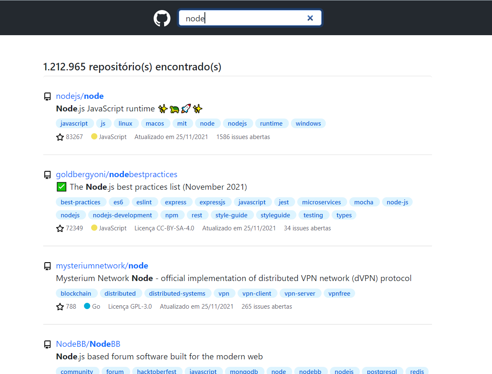

# Desafio frontend para a empresa FieldControl

Essa aplicação foi desenvolvida como solução para o desafio proposto pela empresa FieldControl para atuar como desenvolvedor frontend na mesma.

# O desafio:

Desenvolva um SPA que permitirá que um usuário pesquise repositórios no GitHub (os resultados devem ser paginados) e exiba informações relevantes de cada repositório (URL, descrição, contagem de watchers, de estrelas, issues e etc..)

Basicamente, uma tela _quase_ parecida com essa: https://github.com/search?utf8=%E2%9C%93&q=node&type=

Você pode usar o seu framework SPA de preferencia, porém, estamos dando prioridade para testes feitos em Angular e AngularJS!

Escreva seu código com clareza e use a estrutura adequada do MVC para escrever o aplicativo e use as melhores práticas ao escrever JavaScript, CSS e HTML.

Um diferencial gigante é o uso de testes unitários e integrados!

URLs úteis:

|  URL  | Descrição
|--------|                                  --- |
| https://api.github.com/search/repositories?q=bootstrap | Exemplo de URL da API para pesquisar pelo nome do repositório  |
| https://api.github.com/search/issues?q=repo:username/reponame |  URL da API para exibir issues de um repositório  |

Documentação da API https://developer.github.com/v3/search/#search-issues e https://developer.github.com/v3/search/

# Resultado:

Para desenvolver essa aplicação me inspirei bastante no design do próprio GitHub e utilizei as frameworks frontend **Angular** (v13.0.2) e **Bootstrap** (v5.1.3).
Para rodar a aplicação é necessário ter o Angular instalado e utilizar o comando **npm install** na pasta "desafio-fieldcontrol". Após isso, é necessário utilizar o comando **ng serve -o** na mesma pasta para iniciar o servidor e abrir a aplicação no navegador.

A imagem abaixo apresenta uma screenshot da aplicação desenvolvida:

  

