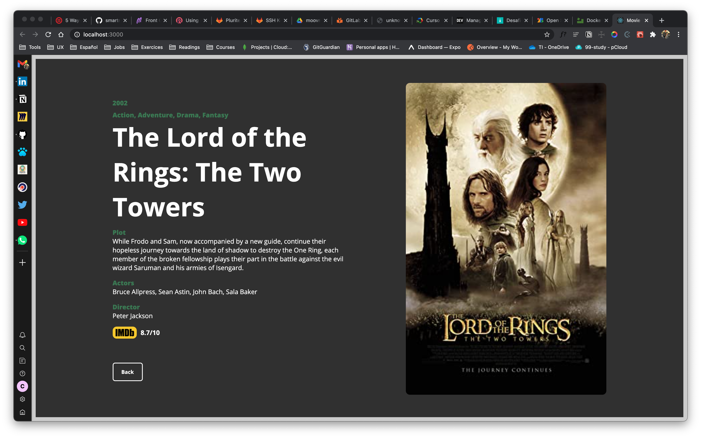

# Movie Box

Aplicativo web para pesquisa de filmes que permite salvar favoritos e obter maior detalhes do filme selecionado.




## Rodando o Aplicativo

```
git clone https://github.com/javi-domi/moviebox-challenge.git

cd moviebox-challenge

docker-compose up
```

## Frontend

Desenvolvido en React e utilizando estilos e controles próprios.

O frontend roda na porta 3000:

```
http://localhost:3000
```

## Backend

O backend roda na porta 8080:

```
http://localhost:8080
```

### Pesquisa por título

Utilizando a API [OMDb API](http://www.omdbapi.com/) criaram se dois endpoints un para realizar a busca por título:

```js
const getMovies = async (req, res) => {
  const url_api = `http://www.omdbapi.com/?s=${req.params.title}&plot=full&apikey=42d64254`;

  axios
    .get(url_api)
    .then((response) => {
      res.send(response.data.Search);
    })
    .catch((error) => {
      console.log(error);
    });
};
```

### Pesquisa por ID

O segundo endpoint faz a requisição por ID do filme que fornece mais detalhes sobre o filme:

```js
const getById = async (req, res) => {
  const url_api = `http://www.omdbapi.com/?i=${req.params.id}&plot=full&apikey=42d64254`;
  axios
    .get(url_api)
    .then((response) => {
      res.send(response.data);
    })
    .catch((error) => {
      console.log(error);
    });
};
```

este endpoint tem como parâmetro o id do filme selecionado na pesquisa por título, fazendo click no poster, abre um modal con toda a informação:

```js
const handleModalPersist = async (movie) => {
  const fullMovieInfo = await MovieService.useID(movie.imdbID);

  setSelectedMovie(fullMovieInfo.data);

  setIsModalOpen(true);
};
```

### Observações

- Não foi utilizado .env ou similares, para facilitar a avaliação do aplicativo.
- Considero que la utilização de containers facilita a desenvolvedores criar um ambiente de desenvolvimento sem o tipico problema de "na minha maquina funciona". Assim mesmo facilita a escalabilidade e gerenciamento de nosso aplicativo na nuvem.
- Foi utilizado React para demostrar meu conhecimento nesta biblioteca e porque há 3 meses que não trabalho com React. Tenho como demostrar outros trabalhos atuales com NestJS e Angular.
- Depois de usar TypeScript por um tempo, não consigo parar de usá-lo.
- Foi necessário utilizar express para tratar erro de CORS.
- Este projeto atende o conceito de MVP pois tem somente as partes funcionais mas importantes. Há muito por ser melhorado e considero que um desenvolvimento com foco em TDD aportariamuito mais a este aplicativo.
- Essa semana coincidentemente é semana de provas na faculdade e o tempo disponível foi muito limitado, por isso gostaria de que, na hora que formos a conversar, ter a oportunidade de mostrar mais de outros projetos tanto profissionais quanto pessoais.
