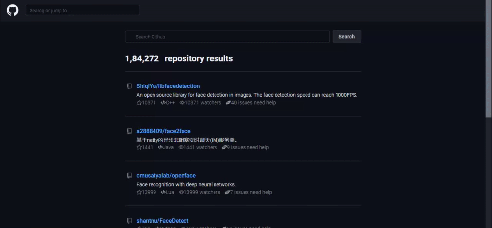
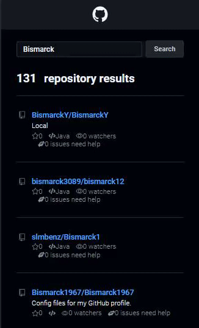

<h1 align="center" id="autor"> 📋 Github Explorer</h1>

<p align="center">Aplicação desenvolvida para realizar pesquisas de repositórios utilizando a API do Github</p>

<div align="center">


</div>

<hr/>
 
 <h1 align="center">
  
</h1>
 <h1 align="center">
  
</h1>

<h4 align="center"> 
	🚧 Em construção...  🚧
</h4>
 
<h2 id="Comousar">💻 Como usar Aplicação</h2>
<hr/>

```bash
# Clone este repositório
$ git clone <https://github.com/BismarckOliveira/valinor.git>

# Acesse a pasta do projeto no terminal/cmd
$ cd valinor

# Instale as dependências
$ yarn

# Execute a aplicação em modo de desenvolvimento
$ yarn start

# A aplicação será aberta na porta:3000 - acesse http://localhost:3000
```

<h2 id="tecnologias">⚒️ Tecnologias</h2>

As seguintes ferramentas foram usadas na construção do projeto:

#### **Website**  ([React](https://reactjs.org/)  +  [TypeScript](https://www.typescriptlang.org/))

-   **[React Icons](https://react-icons.github.io/react-icons/)**
-   **[Axios](https://github.com/axios/axios)**


---

 
 <h2 id="autor">🦸 Autor</h2>


 
 <br />
 <sub><b>Bismarck Oliveira</b></sub> 
 <br />

---

## 📝 Licença

Este projeto esta sobe a licença [MIT](./LICENSE).

Feito por Bismarck Oliveira 👋 [Entre em contato!](https://www.linkedin.com/in/bismarck-oliveira-546308ba/)

---
