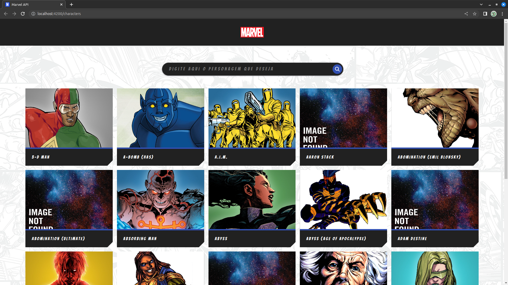
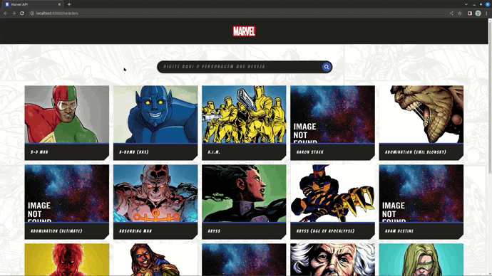
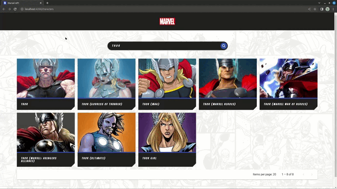

# Projeto Marvel API

# Funcionalidades

### Lista de Personagens

A aplicação inicia na lista de personagens, com design baseado em cards, que renderizam nome e imagem do personagem provindas da API oficial da Marvel.

### Busca de personagem por nome

No topo da página, há uma barra de pesquisa onde pode ser buscado um personagem pelo nome, utilizando um parâmeto da API.

### Modal contendo detalhes do personagem

Ao clicar em um card, um modal contendo nome, imagem, descrição e quadrinhos nos quais o personagem aparece renderiza na tela do usuário. Modal foi feito utilizando a biblioteca de UI do próprio Angular, o Angular Material. 

Ao clicar no "MORE" o usuario sera redirecionado ao site da marvel apresentando mais quadrinhos referente ao personagem buscado.

# Tecnologias utilizadas para o desenvolvimento do projeto

# Projeto está na vercel 

O projeto está hospedado na vercel, <a href="https://valinor-marvel-api.vercel.app/" target="_blank">clicando aqui</a>, você será redirecionado ao projeto final. Caso não funcione, aqui está o link: https://valinor-marvel-api.vercel.app/

# Princípios de Engenharia de Software 

Neste projeto, utilizei o princípio de SRP - (Single Responsibility Principle), buscando dar a cada componente do Angular uma única responsabilidade, facilitando o uso e deixando o código organizado.

# Porque você optou pela tecnologia X e não a Y

Optei por fazer o projeto em Angular, pois foi a minha primeira framework aprendida junto ao Field Academy e também pela própria Field Control já fazer uso dela.

# Desafios encontrados e como foi resolvido 

No percurso do projeto foram encontradas algumas dificuldades das quais com o desenvolvimento foram se amenizando. Primeiramente, iniciei o projeto logo no começo dos estudos com Angular. Após isso, obtive uma certa dificuldade nos components, o qual após bastante prática e dedicação, consegui ultrapassar essa barreira e comecei a organizar os components. Logo depois, tive dificuldade na parte da conexão com a API da Marvel, pois ela exige que o dev utilize uma hash MD5 para acessar os dados, porém com algumas pesquisas e leitura da documentação da API, consegui fazer a conexão. Ademais, não foi preciso fazer requisição à API por ID pois no JSON inicial já vem todas as informações, algo que foi benéfico, uma vez que quanto menos for preciso fazer requisição melhor. 
Outro problema encontrado foi o modal para apresentar os detalhes dos personagens, utilizado com o Angular Material, algo que ainda faz parte do meu processo de aprendizado, cujo conhecimento foi absorvido no curso de Angular da Udemy – indicado durante o treinamento do Field Academy – e diversas pesquisas por fora. Já os testes foram bem complexos para mim, uma vez que a implementação não fazia parte do meu processo habitual, mas consegui implementar da melhor maneira possível com o Jasmine do Angular.
 Enfrentei vários desafios durante o projeto. Contudo, com o impulso dado no Field Academy, com dedicação e pratica, eu consegui superar as objeções e possíveis duvidas apresentadas no processo de criação. Em suma, quero registrar que essas dificuldades me fizeram perceber que com os estudos e pratica as minhas ações serão capazes de resolver os futuros impasses durante as minhas criações e desenvolvimentos.

# O que pode ser melhorado e como fazer 

Por meio dos meus estudos eu percebi a abrangente possibilidade que o Angular traz para o projeto. Contudo, mesmo com essas amplas opções, eu optei fazer algo mais simples mas que atendesse aos pedidos do desafio de maneira excepcional e que o código ficasse organizado. Para além do que já foi feito, planejo fazer uma paginação mais adequada  – colocando uma página inicial que separa melhor os personagens – , planejo colocar as informações por página, diferente do modelo que eu utilizei que foi a SPA e pretendo colocar alguns estilos em CSS mais complexos, deixando o projeto mais harmonioso e com uma melhor responsividade. 

# Sobre mim 

Meu nome é Victor Job, tenho 22 anos e atualmente estou no último ano do curso de Engenharia da Computação na Faculdade UNILAGO. Desde criança, tinha apreço pela tecnologia e com 10 anos, sob influência do meu pai, quando tinha algum problema eu já mexia com as peças dos meus computadores para tentar resolver e as formatações eram feitas por mim. Pelo que eu me lembro, nunca levei um computador para uma loja de informática, pois quaisquer problemas que surgiam eu conseguia resolver, mesmo que alguns fossem mais difíceis. 
Ao entrar na faculdade, eu comecei a conhecer um mundo novo de possibilidades com a programação, mas como trabalhei como técnico de informática no meu segundo e terceiro ano, não consegui progredir muito com meus estudos na área de desenvolvimento. Além disso, no meu último semestre foi quando eu tive mais contato com a programação na faculdade e fui gostando ainda mais da área. Por isso, tive que tomar a difícil decisão de parar de trabalhar como técnico para focar meus estudos na programação, que é o meu sonho.
Depois disso, veio o Field Academy, que foi um divisor de águas na minha vida, tanto profissional como pessoal e que agregou muito nos meus estudos e me proporcionou ter a capacidade de fazer este projeto. Por fim, mesmo após a finalização do treinamento, eu estou corriqueiramente estudando e evoluindo cada dia a mais e me desafiando a buscar o melhor possível para que eu possa entregar os melhores projetos.

# Contatos

<ul>
  <li>E-mail: victorsimon553@gmail.com</li>
  <li>Linkedin: https://www.linkedin.com/in/victor-job-2017b01ab/</li>
</ul>
