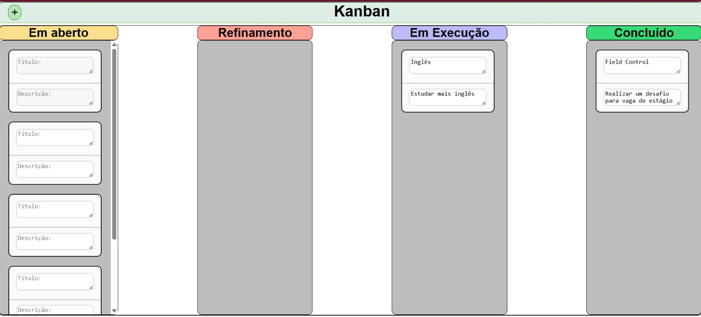

# 🗂️ Kanban App com Angular

Projeto pessoal desenvolvido como desafio técnico para a vaga de estágio na **Field Control**.

## 🚀 Sobre o projeto

Este é um sistema de **Kanban interativo**, desenvolvido com **Angular** e **TypeScript**, que permite:

- Criar e organizar tarefas em cards
- Mover cards entre colunas (drag and drop)
- Editar título e descrição dos cards
- Organização em colunas representando diferentes etapas do processo (ex: Em aberto, Refinamento, Em execução e Concluído.)

## 🧠 Motivação

A proposta deste projeto foi:

- Demonstrar domínio do **framework Angular**
- Praticar **componentização e comunicação entre componentes**
- Aplicar **rxjs, services e observables** para reatividade
- Utilizar **boas práticas de arquitetura e código limpo**
- Criar uma tela intuitiva e responsiva
- **Estudar e conhecer** novas estruturas que utilizei na contrução

## ⚙️ Tecnologias utilizadas

- [Angular](https://angular.io/)
- [TypeScript](https://www.typescriptlang.org/)
- [RxJS](https://rxjs.dev/)
- [Angular CDK - Drag and Drop](https://material.angular.io/cdk/drag-drop/overview)
- HTML5 / CSS3 (com responsividade)
- FormsModule / EventEmitter / Input & Output 

## 🧩 Arquitetura dos Componentes

- **HomeComponent**: componente principal que gerencia o estado geral e as colunas.
- **NavBarComponent**: barra de navegação com botão para adicionar novos cards.
- **CardComponent**: representa uma tarefa, com campos editáveis de título e descrição.
- **ColunaComponent**: representa uma coluna do Kanban, recebe e renderiza os cards.
- **CardService**: serviço responsável por comunicação entre os componentes (por meio de observables).

## 📷 Preview do Projeto


## 🛠️ Como executar localmente

```bash
# Clone o repositório
git clone https://github.com/cristianaLuiza/valinor.git

# Entre na pasta do projeto
cd valinor

# Instale as dependências
npm install

# Rode o servidor de desenvolvimento
npm run start

# Acesse em http://localhost:4200
