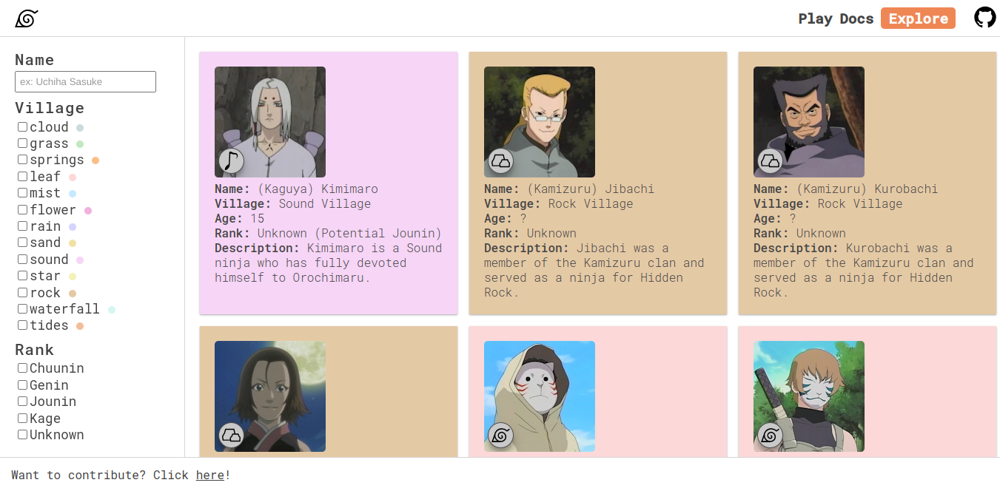
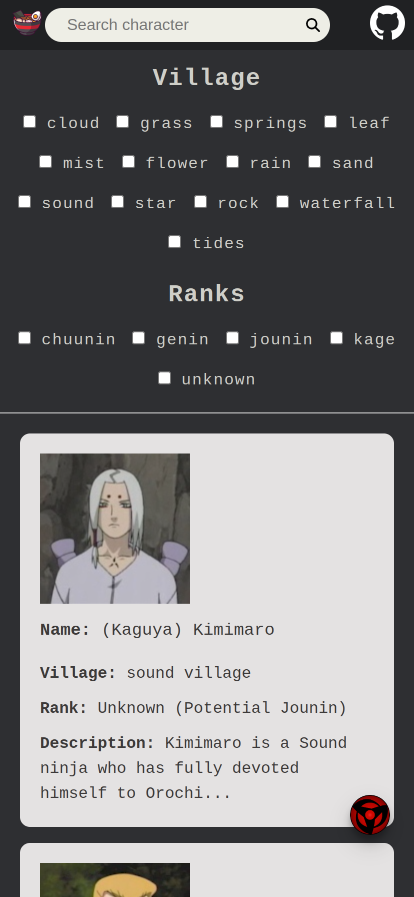
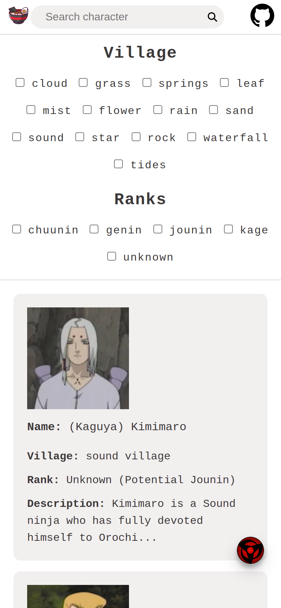
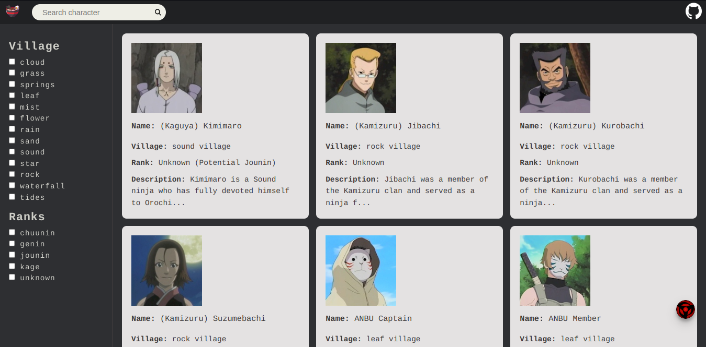
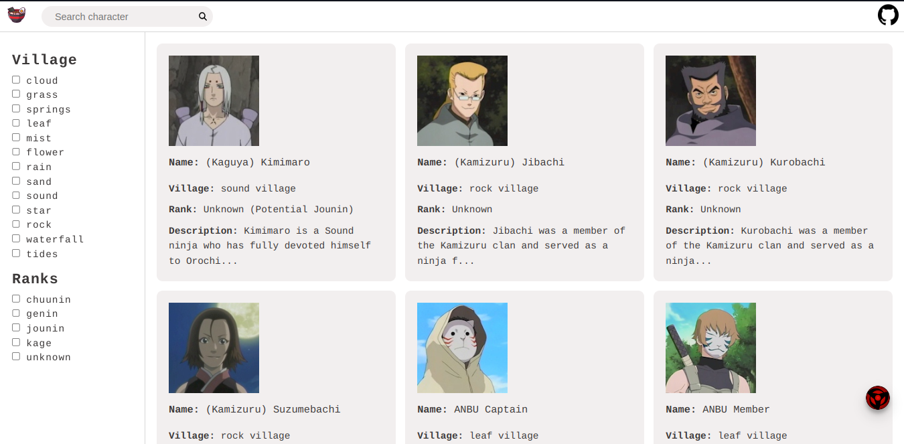

<h1 align="center">Naruto Characters Searcher <!--Naruto Sign icon by Icons8--> </h1>

 

## Available Languages
[Portuguese version :brazil:](https://github.com/GiovanniVINI/NarutoCharactersSearcher/blob/master/READMEptBR.md)

 

## Summary
* [About The Application](#aboutTheApplication)
  * [API Used](#api)
  * [Functionalities](#functionalities)
  * [How to start the project](#start)
* [Inspirations](#inspirations)
* [Screens](#screens)
* [Technologies](#technologies)
  * [HTML](#html)
  * [CSS](#css)
  * [TypeScript](#ts)
  * [Angular](#ang)
  * [Angular Material](#material)
  * [Node.js](#node)
  * [Jasmine/Karma](#jasKar)
* [Principles Of Software Engineering Used](#principles)
* [Challenges, Problems and Solutions](#challenges)
* [Improvements](#improvements)
* [About The Developer](#aboutTheDev)
* [Contact](#functionalities)

 

# About The Application :page_with_curl:

This project aims to consume a public GraphQL API and render information about characters from the Naruto anime/manga on the client side, using the Angular framework. With a simple and user-friendly interface, the user can search for characters and view details such as name, image, description, and rank.

### API

For the project, it was used the API `https://narutoql.up.railway.app/graphql` which serves all the characters data.
 
 

 

### Functionalities

* List of characters and their information
* Clicking on the characters allows you to find out a wider range of information
* Filter by Villages and Ranks
* Search for characters
* Dark mode :new_moon: ou light :sunny:

### Starting The Project
* Install the dependencies: `npm install`
* Run the CLI: `ng serve`
* Go to the following url in your browser: `http://localhost:4200/`

As I hosted the project on a domain, you can access it from this url: https://naruto-characters-searcher.vercel.app/

That's for you to decide :smile:

 

# Inspirations :art:

As inspiration, I looked for visual elements from the API website I'm using: https://www.narutoql.com/explorer.

 

# Screens :computer:

<h3>Mobile</h3>
 
 

 
<h3>Desktop</h3>
 

 

# Technologies :wrench:

## HTML
HTML was used as a markup language to define the structure and content of the web page, allowing the inclusion of elements such as texts and images.

## CSS 
CSS was used to define the visual appearance of the web page, such as colors, fonts, margins, sizes and animations. It allowed to create a nice and easy to use user interface.

## TypeScript
TypeScript is an open-source programming language that is a superset of JavaScript, it was used in the project because it allows adding features like static typing and interfaces to make the code easier to read and maintain.

## Angular
Angular is an open source JavaScript framework maintained by Google. It is used to build single-page web applications and provides a robust framework for application development, testing, and maintenance. Angular was chosen for the project because of its scalable and modular architecture, which facilitates the development of complex applications, in addition to being the first framework I learned, I took advantage of the tool to study and put this project into practice.

## Angular Material
Angular Material is a library of UI (User Interface) components for Angular. It provides a wide range of ready-to-use components such as buttons, menus, tables and dialog boxes, making it easy to develop consistent and pleasing user interfaces. It was specifically used to create a dialog that opens when the user clicks on a character. This dialog displays additional information about the selected character, such as their description, first appearances, etc. This allowed for a more immersive user experience and better presentation of character information.

## Node.js
Node.js was used in this project for a few reasons. First, Angular is built on top of Node.js and uses the npm package manager to install project dependencies.

Furthermore, Node.js is used to run the development server and to build the project for production. The Angular CLI (Command Line Interface) is built on top of Node.js and uses several tools from the Node ecosystem, such as webpack, to compile and build the project.

Finally, many of the libraries used in the project, such as Angular Material, are also built on top of Node.js and available on npm, which makes managing project dependencies easier and more organized.

## Jasmine/Karma
Jasmine is a testing framework used in conjunction with Karma, a test runner that allows you to run tests in real time across multiple browsers. These tools ensure code integrity and help with code maintenance.

 

# Principles Of Software Engineering Used :hammer:
KISS: principle that states that simplicity is the best approach to solving programming problems.

 

# Challenges, Problems and Solutions :exclamation:
During the development of the project, I faced some challenges and problems. As this was my first complete application, I had difficulties mainly with paging and filtering, but I managed to surpass them with a lot of research and hours of programming.

Another hurdle I found was with unit testing. As I have little knowledge on the subject, I had a hard time understanding how to make them. However, I'm studying more about the topic because I understand the importance of testing to ensure code quality and application reliability.

 

# Improvements :bulb:
I believe there's always room for improvement and I will be <b>committed</b> to continually improving my project. At every opportunity, I'll try to update it and use it as a means of learning to discover ways to improve my work.

Here are some possible improvements:

 1. <b>CSS:</b> Improvements in the design of cards, which can be more attractive and well organized, making the user experience more pleasant;
 2. <b>Tests:</b> Addition and improvement unit and integration tests to ensure code integrity and minimize the number of bugs or errors that may occur while running the application;
 3. <b>Secutiry:</b> About the security, I admit that I don't have deepen knowledge in the area, but I am committed to deepening and seeking knowledge to include more effective security measures in future project updates. It's critical to ensure that user data is protected and secure.

 

# About The Developer :sunglasses:

Hello there! My name is Vinícius Giovanni, a 20-year-old guy <strong><u>passionate about programming and website design</u></strong>. I'm currently in the 3rd period of Computer Science.

With a <b>relentless thirst for learning</b> and development, I'm always looking for new challenges to expand my knowledge in the field. My <b>passion for technology</b> motivates me to keep up-to-date with market trends and best development practices.

I'm also looking for an <b>opportunity to work in a team</b>, to grow together with other developers and create <b>innovative solutions</b>. I consider myself a professional <b>committed to the final result</b> and willing to do whatever it takes to deliver quality work.

 

# Contact :pushpin:

 

 

