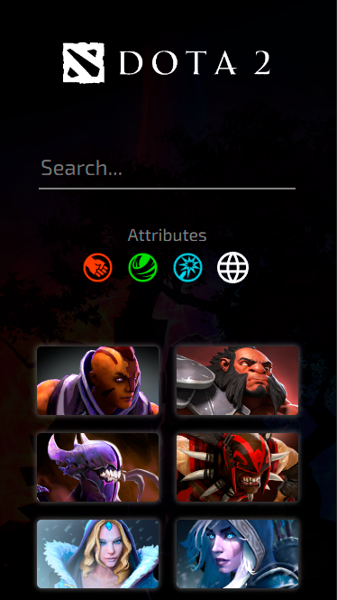
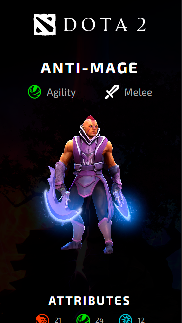
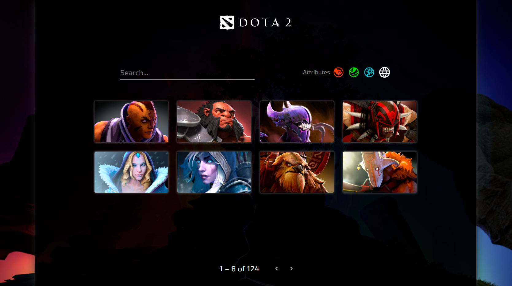
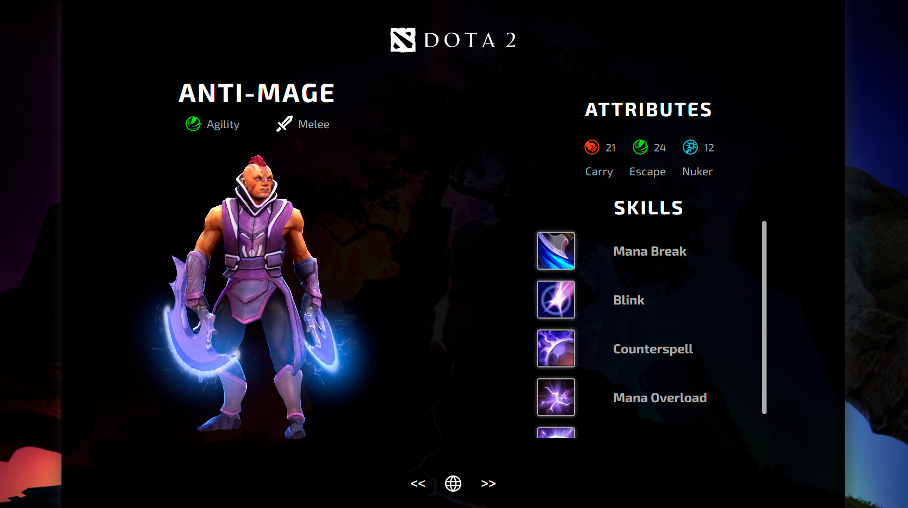

<h1 align="center">
   Dota 2 Heroes
</h1>

<p align="center">
 <a href="#-sobre-o-projeto">Sobre</a> •
 <a href="#-funcionalidades">Funcionalidades</a> •
 <a href="#-layout">Layout</a> • 
 <a href="#-como-executar-o-projeto">Como executar</a> • 
 <a href="#-tecnologias">Tecnologias</a> • 
 <a href="#user-content--licença">Licença</a>
</p>


## 💻 Sobre o projeto

[Dota 2 Heroes](https://valinor-challenge.vercel.app/heroes) - é uma forma de conhecer um pouco mais sobre os personagens do jogo DOTA 2. O site permite que os jogadores pesquisem e vejam informações sobre os heróis disponíveis no jogo. Com uma interface simples e intuitiva, os usuários podem pesquisar heróis por nome ou tipo de herói e ver suas habilidades e atributos.

---

## ⚙️ Funcionalidades

- Pesquisa de heróis: os usuários podem pesquisar heróis por nome ou atributo. Ao digitar o nome do herói na caixa de pesquisa, o site apresenta os resultados correspondentes. O usuário também pode clicar em um dos botões de atributo do herói (agilidade, força e inteligência) para filtrar a lista de heróis de acordo com o tipo desejado.

- Visualização de informações: para cada herói, o site apresenta informações, como habilidades, atributos e funções.

- Responsividade: O site funciona em diferentes dispositivos, incluindo desktops e dispositivos móveis. Ele foi otimizado para telas de 1440 pixels em desktops e 375 pixels em dispositivos móveis.

---

## 🎨 Layout

### Mobile

<p align="center" style="display: flex; align-items: flex-start; justify-content: center; gap: 20px;">
  
  
</p>

### Web

<p align="center" style="display: flex; align-items: flex-start; justify-content: center; gap: 20px;">
  
  
</p>

---
## 🚀 Como executar o projeto

### Pré-requisitos

Você vai precisar ter instalado em sua máquina as seguintes ferramentas:
[Git](https://git-scm.com), [Node.js](https://nodejs.org/en/). 
Além disto é bom ter um editor para trabalhar com o código como [VSCode](https://code.visualstudio.com/)

Depois precisará instalar o framework [Angular](https://angular.io/)

#### 🎲 Iniciando o Projeto

Após clonar o repositório, entre na pasta pelo terminal e execute os comandos

```bash
# Comando para instalar as dependências
$ npm install

# Comando para abrir o site no navegador
$ npm start
```
---
## 🛠 Tecnologias

- **HTML**: é uma linguagem de marcação utilizada para estruturar e exibir o conteúdo da página web.

- **SCSS**: é uma extensão do CSS que adiciona recursos como variáveis, mixins e funções, tornando mais fácil a escrita e manutenção de estilos CSS.

- **TypeScript**: é uma linguagem de programação baseada em JavaScript que adiciona recursos como tipagem estática, classes e interfaces. É utilizada juntamente com o Angular para a construção de aplicativos web escaláveis.

- **Angular**: é um framework JavaScript de código aberto mantido pelo Google que facilita a criação de aplicativos web dinâmicos e escaláveis. Ele utiliza uma arquitetura baseada em componentes para criar interfaces de usuário reutilizáveis.

- **Jasmine**: é um framework de teste de código aberto para JavaScript. Ele permite a escrita de testes automatizados para garantir que o código esteja funcionando corretamente e que as alterações não causem problemas no aplicativo. É frequentemente usado em conjunto com o Angular para testes unitários.

---

## 📝 Licença

Este projeto esta sobe a licença [MIT](./LICENSE).
