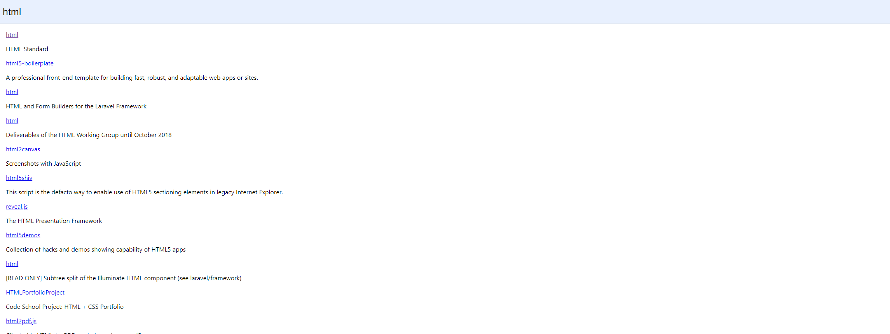

<h1> Buscador de repositórios Github </h1>

<h3> Descrição do Projeto</h3>

Para esse projeto utilizei a biblioteca React para desenvolver esse projeto de SPA. A criação do projeto foi através do Create React App. Para pesquisar basta colocar o nome do repositório que você busca no campo da parte superior e apertar a tecla Enter. 
#
<h3> Executando </h3>

Para estar executando esse projeto basta utilizar os comandos:

yarn start

ou 

npm start
#
<h3> Método </h3>

Através do método FETCH o programa faz uma chamada na API do Github e retorna 30 repositórios relacionados ao termo pesquisado no campo de busca.
#
<h3> Preview </h3>

