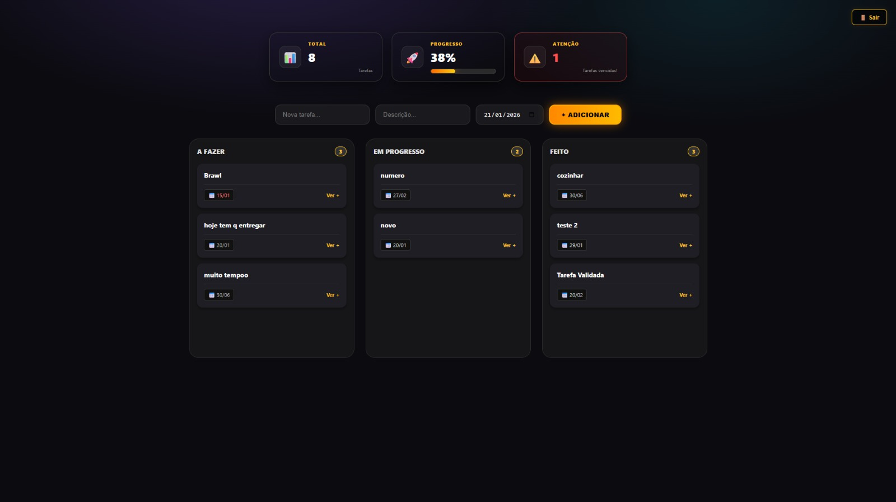

# 📋 Kanban Board Fullstack

> Uma aplicação web interativa para gerenciamento de tarefas, desenvolvida com foco em **arquitetura limpa**, **escalabilidade** e **boas práticas**.

[🎥 Assistir Demonstração (Loom)](https://www.loom.com/share/81375f4716474f1b9480f4cc9210b698) • [📄 Ver Desafios e Soluções](./DESAFIOS.md)

---

## 🖼️ Preview do Projeto

*(Dica: Certifique-se de que a imagem preview.png esteja na pasta assets)*

---

## 🚀 Sobre o Projeto

Este projeto foi desenvolvido como parte de um **desafio técnico** para demonstrar competências em desenvolvimento **Fullstack**.

O objetivo foi criar um quadro Kanban onde o usuário pode gerenciar seu fluxo de trabalho de forma fluida, movendo tarefas entre as colunas **"A Fazer"**, **"Em Progresso"** e **"Concluído"**.

### ✨ Funcionalidades Principais
* ✅ **CRUD Completo:** Criação, Leitura, Atualização e Exclusão de tarefas.
* 🔄 **Drag & Drop:** Interface intuitiva (Angular CDK) para arrastar tarefas entre colunas.
* 💾 **Persistência de Dados:** API robusta em NestJS para salvar o estado das tarefas.
* 🛡️ **Validação de Dados:** Utilização de DTOs e Pipes no Backend para garantir integridade.
* 📱 **Interface Responsiva:** Layout adaptável para diferentes tamanhos de tela.

---

## 🧠 Desafios e Aprendizados

Durante o desenvolvimento, documentei os principais problemas enfrentados (técnicos e lógicos) e como cada um foi solucionado. Isso demonstra minha linha de raciocínio para resolução de problemas.

👉 **[Clique aqui para acessar o Histórico de Desafios e Soluções (DESAFIOS.md)](./DESAFIOS.md)**

---

## 🛠️ Tecnologias Utilizadas

### 🎨 Frontend (Client)
* **Angular 16+**: Estrutura baseada em componentes reutilizáveis.
* **Angular CDK**: Implementação otimizada de Drag and Drop.
* **RxJS**: Gerenciamento de estado reativo e manipulação de fluxos de dados.
* **SCSS**: Estilização modular e organizada.

### ⚙️ Backend (Server)
* **NestJS**: Framework progressivo e modular para Node.js.
* **TypeScript**: Tipagem estática para maior segurança e manutenibilidade.
* **In-Memory DB**: Estrutura de dados para persistência rápida durante o teste.

---

## 🧩 Estrutura e Arquitetura

O projeto segue uma arquitetura modular para facilitar a manutenção e testes.

* **Backend:** Organizado nos padrões do NestJS (Modules, Controllers e Services), garantindo Injeção de Dependência e separação de responsabilidades (SOLID).
* **Frontend:** Componentes isolados para o Quadro (Board) e Cartões (Card), facilitando o reuso de código e testes unitários.

---

## 📦 Como Rodar o Projeto

Siga os passos abaixo para executar a aplicação em seu ambiente local.

### Pré-requisitos
Certifique-se de ter o **Node.js** e o **Git** instalados em sua máquina.

### 1. Clonar o repositório

git clone [https://github.com/Taino-Edu/kanban-finalizado.git](https://github.com/Taino-Edu/kanban-finalizado.git)
cd kanban-finalizado
2. Configurar e Rodar o Backend (API)
Abra um terminal e navegue até a pasta do servidor:

Bash

cd backend
npm install
npm run start:dev
🚀 O backend estará rodando em: http://localhost:3000

3. Configurar e Rodar o Frontend (Interface)
Abra um novo terminal e navegue até a pasta do cliente:

Bash

cd frontend
npm install
ng serve
🎨 Acesse a aplicação no navegador em: http://localhost:4200

## 👨‍💻 Autor & Considerações Finais

  
   
   

  ### Eduardo Taino
  *Fullstack Developer em formação*

   

  > "Sou um profissional **determinado**, com **paixão por aprender** e que **ama desafios**. 
  > A realização deste projeto foi um marco fundamental na minha carreira, pois me tirou da zona de conforto e exigiu evolução."
  >
  > *Muito Obrigado por fazer parte da minha evolução ❤️ 🔥*

   

  
  
  
   
  
  ✉️ **esusxd0@gmail.com** | 📱 **(17) 99245-2824**

---
