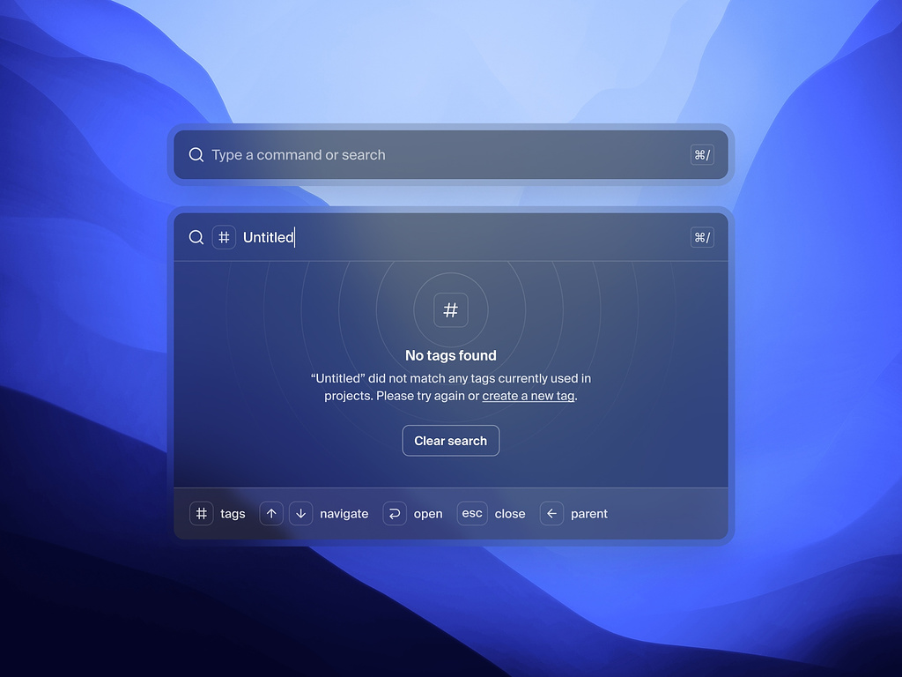

# Pesquisa de Repositório GitHub


Este projeto consiste em uma aplicação de pesquisa de repositórios GitHub, desenvolvido com Angular e utilizando a API do GitHub para buscar e exibir informações sobre os repositórios.

## Desafio e Inspiracão

Durante minha última entrevista com Guilherme, fui desafiado a buscar um layout no Dribbble e recriá-lo em minha aplicação de pesquisa de repositórios. Optei por não utilizar nenhuma estrutura de framework, pois meu objetivo era aprimorar minhas habilidades em JavaScript, aplicando tudo o que aprendi assistindo canais como o do Erick Wendel.

Caso minha escolha de não utilizar frameworks não seja bem recebida, por favor, me informe para que eu possa refazer o projeto. Já tentei três vezes, mas uma vez a mais é moleza!


## Layout Inspirado no Dribbble

Para aprimorar a experiência do usuário, busquei inspiração no seguinte layout do Dribbble:

<a href="https://dribbble.com/shots/21271786-Command-K-search-menu-Untitled-UI">
  
</a>


## Informações do Repositório

A aplicação exibe as seguintes informações sobre cada repositório:

- Título
- Descrição
- Contagem de visualizadores
- Contagem de estrelas
- Contagem de issues abertas

## Tecnologias Utilizadas

- **Http-server** (v14.1.1) - Servidor HTTP simples para servir arquivos estáticos.
- **Jest** (v29.6.1) - Framework de testes para JavaScript.
- **GitHub REST API** - API do GitHub para obter dados dos repositórios.

## Como Executar a Aplicação

Siga os passos abaixo para executar a aplicação localmente:

1. Clone o repositório em seu ambiente de desenvolvimento:

```bash
git clone https://github.com/tauk7/valinor.git
```

2. Acesse o diretório do projeto:

```bash
cd valinor
```

3. Instale as dependências:

```bash
npm install
```

4. Inicie a aplicação:

```bash
npm start
```

5. Acesse a aplicação em seu navegador, acessando o seguinte endereço:

```
http://localhost:8080/
```

## Como Testar a Aplicação

Para garantir o correto funcionamento da aplicação, foram criados testes automatizados com o Jest. Para executar os testes, siga os passos abaixo:

1. Acesse o diretório do projeto:

```bash
cd valinor
```

2. Execute os testes:

```bash
npm test
```

Verifique se todos os testes foram executados com sucesso.

## Contato

- Email: matheushenriquedemacedobarreto@gmail.com
- Telefone: (17) 99286-2586