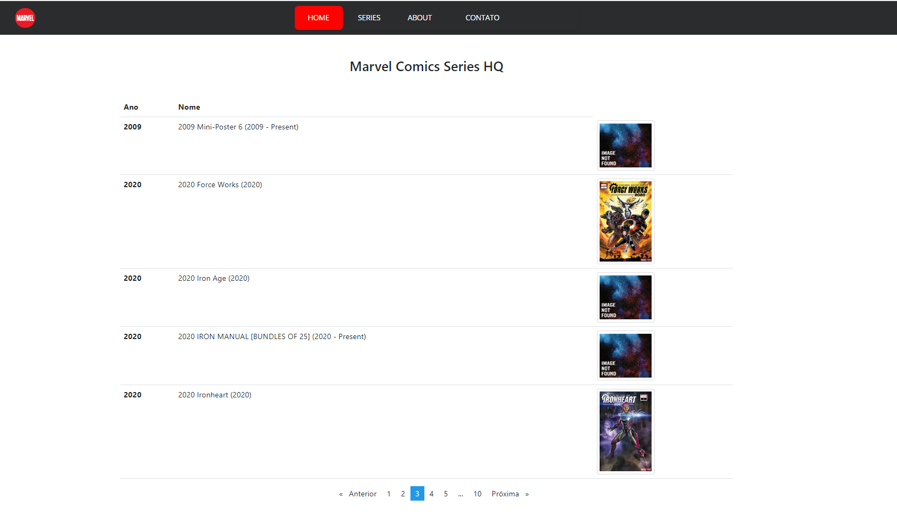

# AngularChallengeSPA

Até então não sabia de SPA e foi através desse desafio que passei a conhecer e entender seus conceitos.

- Ferramenta usada: Aplicação em Angular, foi algo novo para mim então de fato foi um desafio e tanto pois tive que aprender os conceitos e funcionalidades bem como sua utilização.
- Tecnologias: Escolhi trabalhar com CSS, Bootstrap e Javascrip por conta da familiaridade.
- Princípios da engenharia usados: KISS (Keep It Simple, Stupid!), devido ao pouco tempo que tive disponivel para me didicar ao desafio o projeto todo foi em cima desse conceito.
- Desafios e problemas encontrados: Desemmvolver SPA em cima de seus conceitos, consegui superar essa barreira lendo as documentações.
- Melhorias: Implementação de pesquisas bem como organização por categorias são algumas delas.
----------

# Exemplos

  

  

  

