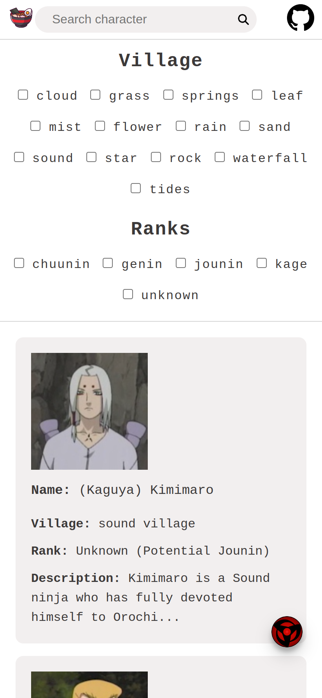
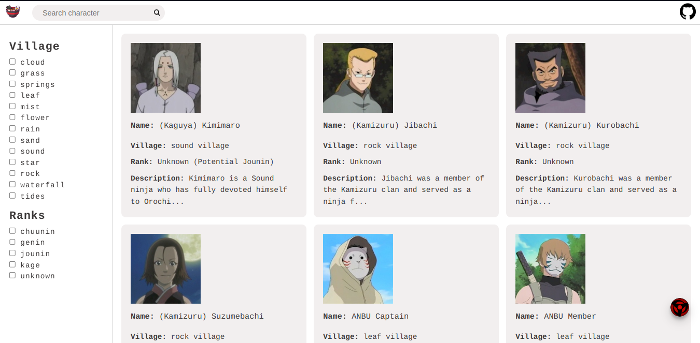

<h1 align="center">Naruto Characters Searcher <!--Naruto Sign icon by Icons8--> </h1>

 

## Idiomas Disponíveis
[Versão em inglês :us:](https://github.com/GiovanniVINI/valinorNaruto/blob/master/README.md)

 

## Sumário
* [Sobre a Aplicação](#aboutTheApplication)
  * [API Utilizada](#api)
  * [Funcionalidades](#functionalities)
  * [Como iniciar o projeto](#start)
* [Inspirações](#inspirations)
* [Telas](#screens)
* [Tecnologias](#technologies)
  * [HTML](#html)
  * [CSS](#css)
  * [TypeScript](#ts)
  * [Angular](#ang)
  * [Angular Material](#material)
  * [Node.js](#node)
  * [Jasmine/Karma](#jasKar)
* [Princípios da Engenharia de Software Utilizados](#principles)
* [Desafios, Problemas e Soluções](#challenges)
* [Melhorias](#improvements)
* [Sobre o Desenvolvedor](#aboutTheDev)
* [Contato](#contact)

 

# Sobre a Aplicação :page_with_curl:

Este projeto tem como objetivo consumir uma API GraphQL pública e renderizar informações sobre personagens do anime/mangá Naruto no lado do cliente, por meio do framework Angular. Com uma interface simples e fácil de usar, o usuário pode pesquisar personagens e visualizar detalhes como nome, imagem, descrição e rank. 

### API

 Para o projeto foi utilizado a API `https://narutoql.up.railway.app/graphql` onde é servido todos os dados dos personagens.
 
 

 

### Funcionalidades

* Listagem de personagens e suas informações
* Clicar nos personagens permite averiguar uma gama de informações maior
* Filtro de Vilas e Ranks
* Pesquisa por personagens
* Tema escuro :new_moon: ou claro :sunny:

### Iniciando o projeto
* Instale as dependências: `npm install`
* Execute o CLI: `ng serve`
* Acesse no navegador a seguinte url: `http://localhost:4200/`

Como hospedei o projeto em um domínio, você pode acessa-lo a partir dessa url: https://naruto-characters-searcher.vercel.app/

Fica a seu critério :smile:

 

# Inspirações :art:

Como inspiração, busquei de elementos visuais do próprio site da API que estou utilizando: https://www.narutoql.com/explorer.

 

# Telas :computer:

<h3>Mobile</h3>
 
 

 
<h3>Desktop</h3>
 

 

# Tecnologias :wrench:

## HTML
O HTML foi utilizado como a linguagem de marcação para definir a estrutura e o conteúdo da página web, permitindo a inclusão de elementos como textos e imagens.

## CSS 
O CSS foi utilizado para definir a aparência visual da página web, como cores, fontes, margens, tamanhos e animações. Ele permitiu criar uma interface de usuário agradável e fácil de usar.

## TypeScript
TypeScript é uma linguagem de programação open-source que é um superset do JavaScript, foi utilizado no projeto pois, permite adicinar recursos como tipagem estática e interfaces para tornar o código mais fácil de ler e manter.

## Angular
O Angular é um framework JavaScript de código aberto mantido pela Google. Ele é utilizado para construir aplicativos web de página única e oferece uma estrutura robusta para desenvolvimento, testes e manutenção de aplicativos. O Angular foi escolhido para o projeto por sua arquitetura escalável e modular, que facilita o desenvolvimento de aplicativos complexos, além de também ter sido o primeiro framework que aprendi, aproveitei a ferramenta para estudar e por em prática esse projeto.

## Angular Material
O Angular Material é uma biblioteca de componentes UI (User Interface) para o Angular. Ele fornece uma ampla gama de componentes prontos para uso, como botões, menus, tabelas e caixas de diálogo, facilitando o desenvolvimento de interfaces de usuário consistentes e agradáveis. Ele foi utilizado especificamente para criar um dialog que é aberto quando o usuário clica em um personagem. Esse dialog exibe informações adicionais sobre o personagem selecionado, como sua descrição, primeiras aparições etc. Isso permitiu uma experiência mais imersiva para o usuário e uma melhor apresentação das informações sobre os personagens.

## Node.js
O Node.js foi utilizado nesse projeto por algumas razões. Primeiro, o Angular é construído em cima do Node.js e usa o gerenciador de pacotes npm para instalar as dependências do projeto.

Além disso, o Node.js é utilizado para rodar o servidor de desenvolvimento e para buildar o projeto para produção. O Angular CLI (Command Line Interface) é construído em cima do Node.js e utiliza diversas ferramentas do ecossistema Node, como o webpack, para compilar e construir o projeto.

Por fim, muitas das bibliotecas utilizadas no projeto, como o Angular Material, também são construídas em cima do Node.js e disponibilizadas no npm, o que torna o gerenciamento de dependências do projeto mais fácil e organizado.

## Jasmine/Karma
Jasmine é um framework de testes utilizado em conjunto com o Karma, um test runner que permite executar testes em tempo real em vários navegadores. Essas ferramentas garantem a integridade do código e ajudam na manutenção do mesmo.

 

# Princípios da Engenharia de Software Utilizados :hammer:
KISS: princípio que prega que a simplicidade é a melhor abordagem para a resolução de problemas de programação.

 

# Desafios, Problemas e Soluções :exclamation:
Durante o desenvolvimento do projeto, enfrentei alguns desafios e problemas. Como essa foi minha primeira aplicação completa, tive dificuldades principalmente na paginação e na filtragem, mas consegui superá-las com muita pesquisa e horas de programação.

Outro obstáculo que encontrei foi com os testes unitários. Como eu tinha pouco conhecimento sobre o assunto, tive dificuldade para entender como fazê-los. No entanto, estou estudando mais sobre o tema porque entendo a importância dos testes para garantir a qualidade do código e a confiabilidade da aplicação.

 

# Melhorias :bulb:
Acredito que <strong><u>sempre</u></strong> há espaço para melhorias e estarei <strong><u>comprometido</u></strong> em aprimorar continuamente o meu projeto. A cada oportunidade, buscarei atualizá-lo e utilizá-lo como um meio de aprendizado para descobrir maneiras de aprimorar meu trabalho.

Aqui vão algumas possiveis melhorias:

 1. <b>CSS:</b> Melhorias no design dos cards, que podem ser mais atraentes e bem organizados, tornando a experiência do usuário mais agradável;
 2. <b>Testes:</b> Adição e melhoria de testes unitários e integrados para garantir a integridade do código e minimizar o número de bugs ou erros que possam ocorrer durante a execução do aplicativo;
 3. <b>Segurança:</b> Com relação à segurança, admito que não tenho conhecimento aprofundado na área, mas estou comprometido a me aprofundar e buscar conhecimentos para incluir medidas de segurança mais eficazes em futuras atualizações do projeto. É fundamental garantir que os dados dos usuários estejam protegidos e seguros.

 

# Sobre o Desenvolvedor :sunglasses:

Olá! Me chamo Vinícius Giovanni, um jovem de 20 anos <strong><u>apaixonado por programação e design de websites</u></strong>. Atualmente estou cursando o 3º período de Ciência da Computação. 

Com uma <b>sede incansável de aprendizado</b> e desenvolvimento, estou sempre em busca de novos desafios para expandir meu conhecimento na área. Minha <b>paixão pela tecnologia</b> me motiva a me manter atualizado com as tendências do mercado e as melhores práticas de desenvolvimento.

Também estou em busca de uma <b>oportunidade de trabalhar em equipe</b>, para crescer junto com outros desenvolvedores e criar <b>soluções inovadoras</b>. Me considero um profissional <b>comprometido com o resultado final</b> e disposto a fazer o que for necessário para entregar um trabalho de qualidade.

 

# Contato :pushpin:

 

 

