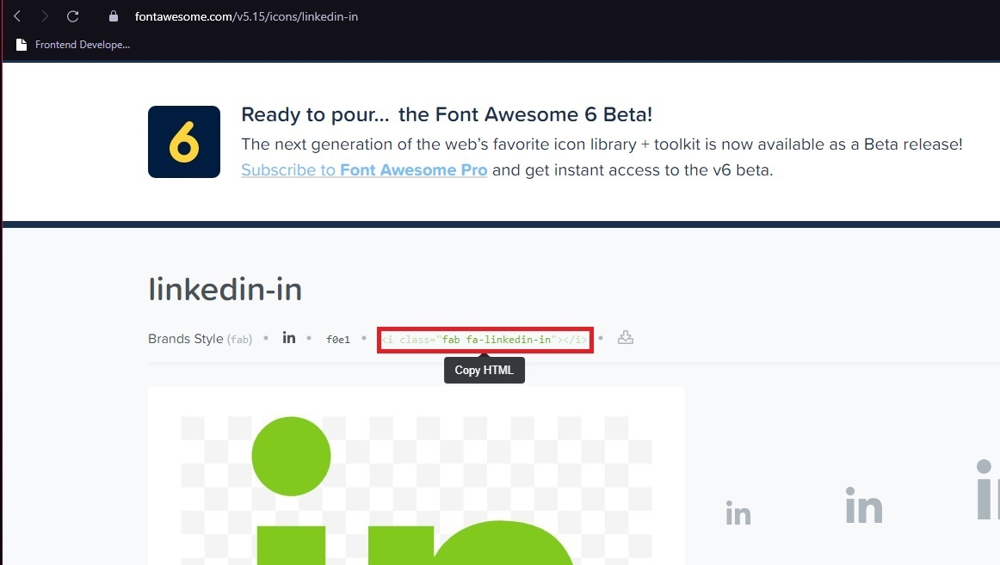

## Frontend Developer Iniciante 
<h1>
   
</h1>

---

## Sobre
Esta **landing page** foi criada com a proposta de entrega um desing simples e facil acesso.

---

## tecnologias utilizadas
---

No projeto foi utilizada as seguinte linguagens;
- html5
- css3
- javascript

## Ferramentas utilisada 
- VScode 
- photoshop.
---
## Informações basicas

---
``` html 
Caso queira troca o logo e adicionar link 
<div class="media-icons">
            <!--para adiciona link externo e so apaga o # no "href" e adiciona o link exemplo: <a href="https://www.facebook.com"> -->
            <a href="#"><i class="fab fa-facebook-square"></i></a>
            <a href="#"><i class="fab fa-twitter-square"></i></a>
            <a href="#"><i class="fab fa-linkedin"></i></a>
        </div>
``` 
### classes com possivel troca e adição link;
- Ttext-btn
- media-icons
- icon-links
- card-btn
- pic-btn
- read-more
- navigation

---
### No caso na troca do [logo](https://cdnjs.cloudflare.com/ajax/libs/font-awesome/5.15.3/css/all.min.css) sera necesario ascessar [Font Awesome](https://fontawesome.com/v5.15/icons?d=gallery&p=2&q=li) e copiar o texo que esta na imagem.

<h1>

   
   
</h1>

e colar em  "i"

``` html
<a href="#"><i class="fab fa-facebook-square"></i></a>

```
exemplo:

<h1>

   

</h1>

### Classes com possivel troca dos logos;
- icon-links
- media-icons

### na troca de imagens e o  plano de fundo sera nescesario;

``` html 

<div class="picbx">
    <!--para troca a imagem e so subistituir o diretorio q esta dentro da aspas-->
                
            </div>

```
### a troca de plano de fundo funciona em todas as sessões

```  css  
section{
     position: relative;
     width: 100%;
     min-height: 100vh;
     display: flex;
     flex-direction: column;
     justify-content: flex-start;
     /*para troca o plano de fundo so subistuir o diretorio q esta dentro de ()*/
     background: url(imagens/BG.jpg)no-repeat;
     /*caso queria q o plano de fundo fique so na sessão troque "fixed" por scroll*/
     background-attachment: fixed;
     /*define o tamanho do plano de fundo :primeiro valor: largura da imagem, segundo valor: altura*/
     background-size: 100% 100%;
 }
```
---

 ### classes com possivel troca de imagen ;
 - Grid
 - picbx
 - pro
 - slide active

 ---

## Javascript responsavel pelo slide esta localisado dentro do arquivo html "index.html"

<h1>

   

</h1>