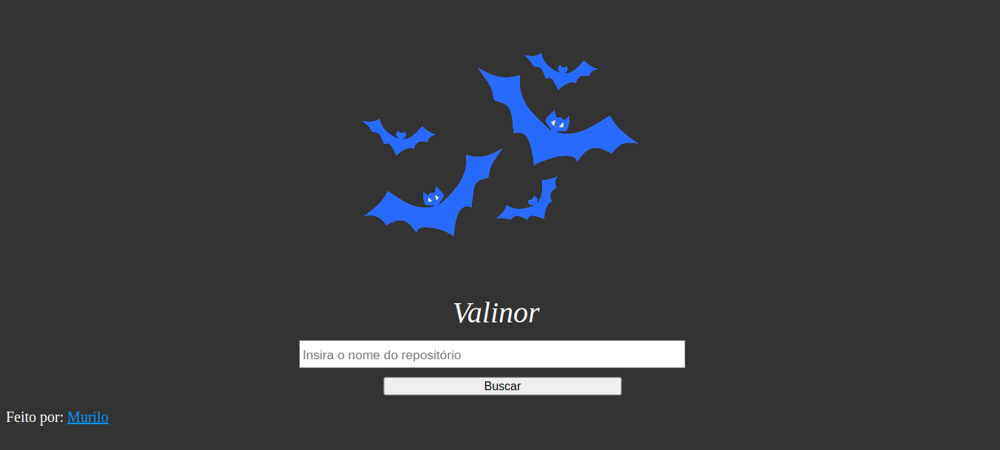

# Desafio Técnico Valinor 🌳

## Desafio técnico da Field Control, consumindo a API do GitHub para consulta de repositórios, com paginação! 🔍
  <strong>[Você pode acessar este projeto clicando aqui!](https://gitmurilo.github.io/ValinorProjectMurilo/index.html)</strong>

## Sobre mim 👨‍💻
  Olá, me chamo Murilo e estive presente na entrevista feita na FATEC, estou em busca de um estágio e tenho grande interesse em desenvolvimento web e segurança da informação. Gosto de pensar como as coisas podem ser modificadas e alteradas de diversas maneiras fora do convencional e acredito que isso proporciona uma grande compreensão do que é criado, desmontado e recriado. Ainda me considero um iniciante na programação e sei que há muito o que melhorar, mas tenho grande vontade de aprender e praticar o que estudo, sempre gostei e tive grande contato com tecnologia na infância e adolescência, desde jogos online, emuladores e tentativas de hacking e gamedev sempre gostei de passar um tempo no computador e vejo a incrível capacidade que a computação e programação tem de serem aplicadas em diversas áreas.

## Tecnologias utilizadas 🚀
- HTML5
- CSS3
- JavaScript
- GitHub API REST
  
## Screenshot 📸

## Implementação de segurança na consulta 🔒
Ao realizar consultas com um payload de XSS pude perceber a vulnerabilidade no consumo da API, pois os dados não eram sanitizados adequadamente. 
Pude reparar que ao digitar no campo de pesquisa (input) o payload:
<code> <script>alert("XSS")<script></code> 
Eram executados repositórios maliciosos com esse nome, redirecionando para páginas paralelas na própria aplicação!

O XSS (Cross-site Scripting) é um tipo de vulnerabilidade que permite a execução de código em campos de entrada, colocando o sistema em risco pois invasores podem utilizar do redirecionamento de página para roubo de informações, sequestro de tokens de sessão, disseminação de malwares etc. Existindo tanto o tipo refletido (executado apenas na sessão e navegador atual) como o tipo armazenado (salvo no servidor e mantido de forma persistente, por isso também chamado de XSS persistente).

Você pode ler mais sobre XSS aqui:
 **[O que é a vulnerabilidade XSS?](https://www.kaspersky.com.br/resource-center/definitions/what-is-a-cross-site-scripting-attack)**

Para realizar a correção fiz a sanitização dos parâmetros de requisição para nodeValue, onde o navegador não mais interpretaria as entradas como código e sim como texto.

<strong>Código antigo (vulnerável) 👾</strong> 

<code> 
 repoItem.innerHTML = `
             
                <a href=${repo.html_url} style="color:rgb(0, 132, 255)" target="_blank"><strong>${repo.full_name}</strong></a> 
                🌟Stars: ${repo.stargazers_count} | 👀Watchers: ${repo.watchers_count} 
                📋Forks: ${repo.forks_count} | 🚨Issues: ${repo.open_issues_count} 
                💾Descrição: ${repo.description}  
                

            `;
            
            reposList.appendChild(repoItem);
        });
</code>

<strong>Código atualizado (seguro contra XSS) ✔️</strong> 

<code> 
 repoItem.innerHTML = `
             
                //Sanitização de dados antes da interpretação pelo navegador (Evitar XSS)//
                    const SanitizedRepoName = document.createTextNode(repo.full_name);
                    const SanitizedDescription= document.createTextNode(repo.description);
                    const SanitizedStars= document.createTextNode(repo.stargazers_count);
                    const SanitizedWatchers= document.createTextNode(repo.wachers_count);
                    const SanitizedForks= document.createTextNode(repo.forks_count);
                    const SanitizedIssues= document.createTextNode(repo.open_issues_count);
                    const SanitizedUrl=document.createTextNode(repo.html_url);
    
    
    
                repoItem.innerHTML = `
                 
                    <a href=${SanitizedUrl.nodeValue} style="color:rgb(0, 132, 255)" target="_blank"><strong>${SanitizedRepoName.nodeValue}</strong></a> 
                    🌟Stars: ${SanitizedStars.nodeValue} | 👀Watchers: ${SanitizedWatchers.nodeValue} 
                    📋Forks: ${SanitizedForks.nodeValue} | 🚨Issues: ${SanitizedIssues.nodeValue} 
                    💾Descrição: ${SanitizedDescription.nodeValue}  
                    

                `;
                
                reposList.appendChild(repoItem);
            });
</code>

## CONTATO ☎✉️
Email: murilosantosdeveloper@protonmail.com 📧 
LinkedIn: https://www.linkedin.com/in/murilo-santoss/ 💼  
  
