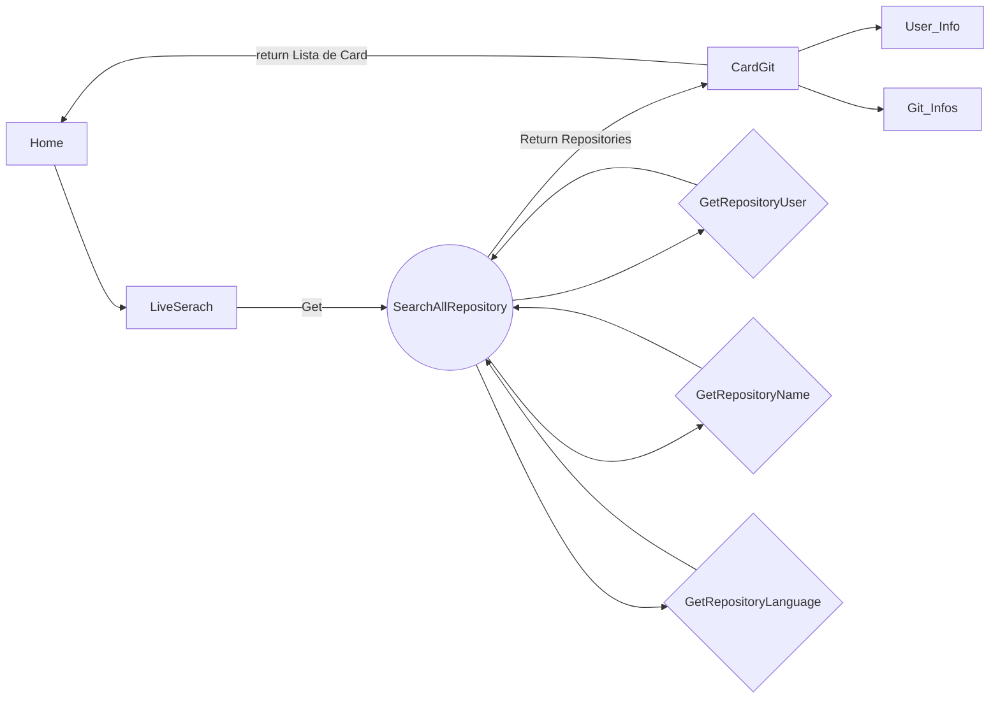
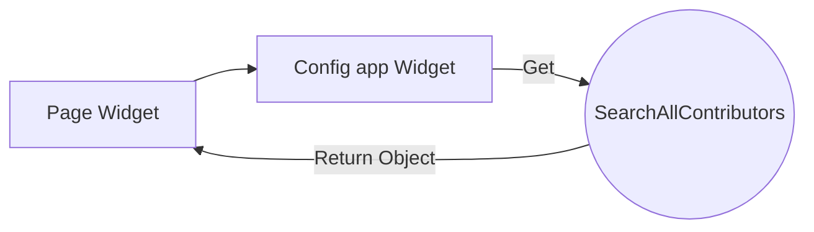
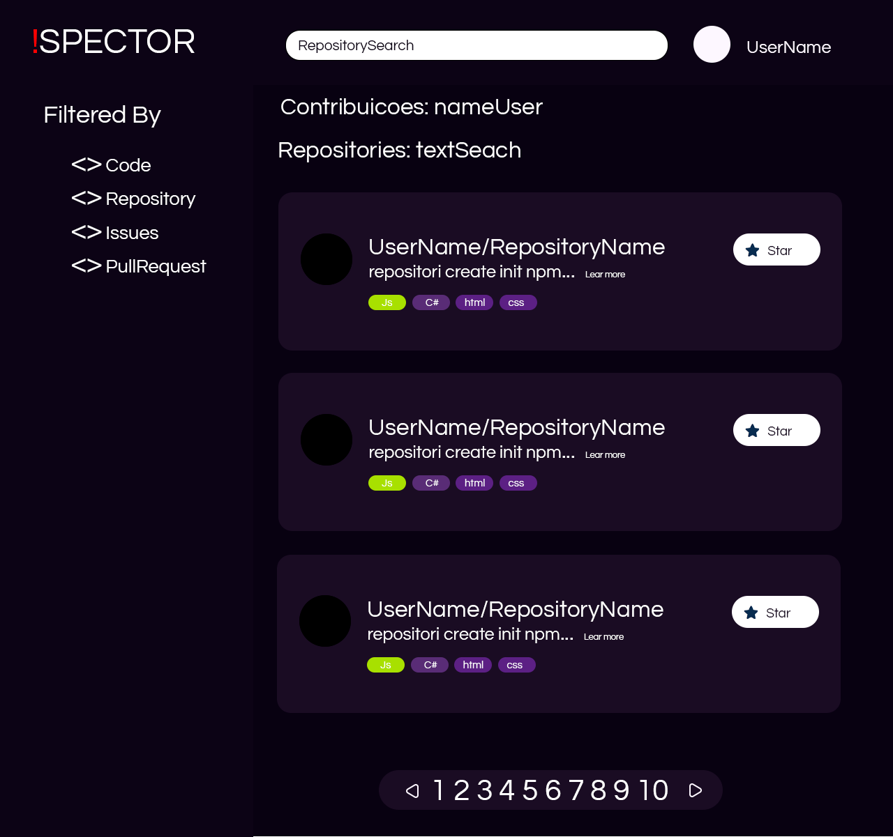

# Bem-vindo ao GitInspector!

O gitInspector surgiu de uma ideia antiga + Teste de Programação
para empresa FieldControl:  https://github.com/FieldControl .

A ideia e Listar todos os repositório do git,( Nome do usuario, nome do repositório.

Mobile: Funcionalidades a mais : Widget dos commits do usuario

# Como funciona ?

**Components**
	Home 
	
		Vai englobar todos os outros components
   Header

		conter informacoes de header -> apenas visual
LiveSearch	
			
			barra de pesquisa que vai filtrar em tempo real
Card_Git
			
		Vai conter o componente User_Info e componente Git_Infos
		
User_Info
			
			img do usuario e nome do repositorio_Usuario e
			descricao

Git_Infos
				
				quantidade de estrelas, ultima atualizacao
	
	
	
**Web:** 
LiveSearch: Ao pesquisar no SearchBar, ele vai fazer um filtro de pesquisa aonde : 

**Fora do escopo por Enquanto**:
**Mobile**
 Widget View :

**Links References:**
https://angular.io/guide/what-is-angular
https://angular.io/tutorial/first-app
<instalar bootstrap>
https://www.youtube.com/watch?v=Qv62pYv-FIM

