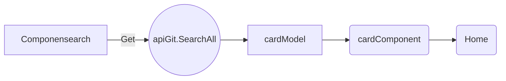
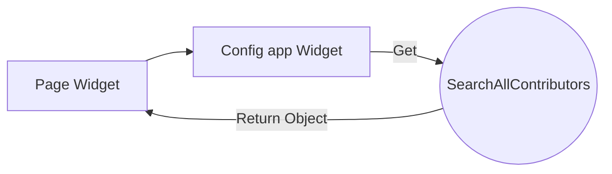

# Bem-vindo ao GitInspector!

O gitInspector surgiu de uma ideia antiga + Teste de Programação
para empresa FieldControl:  https://github.com/FieldControl .

A ideia e Listar todos os repositório do git,( Nome do usuario, nome do repositório.

Mobile: Funcionalidades a mais : Widget dos commits do usuario

# Como funciona ?

**Components**
	Home 
	
		Vai englobar todos os outros components
   Header

		Conter component Seach para pesquisa
Search	
			
		Buscar informacoes na Api Apartir do texto de pesquisa
		
Card
			
		Componente que carrega os componentes headerCard, footerCard,
	

HeaderCard
			
		Componente que cerrga imagem, nome e botao
FooterCard
			
		Componente que cerrga observacoes, topicos, lingua, 
		ultima atualizacao e estrelas
	
**Web:** 
LiveSearch: Ao pesquisar no SearchBar, ele vai fazer um filtro de pesquisa aonde : 

**Fora do escopo por Enquanto**:
**Mobile**
 Widget View :

**Links References:**
https://angular.io/guide/what-is-angular
https://angular.io/tutorial/first-app
<instalar bootstrap>
https://www.youtube.com/watch?v=Qv62pYv-FIM
