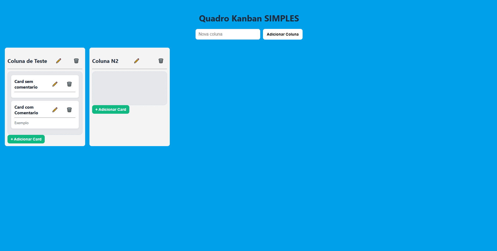

# ❗ Introdução

Primeiramente, gostaria de agradacer a Field pela oportunidade de aprendizado, resolver esse desafio foi (e ainde é) um desafio. Esse foi meu primeiro contato com Angular, Nest e Typescript, assisti vídeos, fiz pesquisar e me aproveitei do avanço tecnológico das IAs para avançar nesse projeto. Reconheço que ainda há muito para melhorar e que, com certeza, existem decições melhores que poderiam ter sido tomadas durante o projeto, porém, estou contente por ter me desafiado a aprender algo novo e finalizar um projeto, mesmo sendo extremamente básico, orgulhoso do que consegui com apenas uma semana, saindo de "não saber nada" para "mais um item pra minha lista de estudos". O Angular e todo seu ecosistema é fantástico e com certeza estarei indo atrás de explorar mais de seus recuros (com sorte, com a ajuda do pessoal da Field 😊). Enfim, obrigado pela chance e estou disposto a continuar aprendendo e crescendo com vocês nesse mundo louco que é a TI, muito obrigado!

# 📝 Kanban Simples (Angular + NestJS)

Este é um sistema simples de **Kanban** construído com **Angular 19+** no frontend e **NestJS** no backend. Ele permite a criação de **colunas** e **cards**, com suporte a edição e remoção. Todos os dados são mantidos em memória, com comunicação feita via **GraphQL**.

---

## 🚀 Como Executar o Projeto

### 📦 Requisitos

- Node.js 18+
- NPM
- Angular CLI (`npm install -g @angular/cli`)
- Nest CLI (`npm install -g @nestjs/cli`)

### 📁 Clonar o projeto

```bash
git clone https://github.com/seu-usuario/kanban-simples.git
cd kanban-simples
```

---

### 🖥️ Backend (NestJS)

```bash
cd backend
npm install
npm run start:dev
```

O backend será iniciado em: [http://localhost:3000/graphql](http://localhost:3000/graphql)

---

### 🌐 Frontend (Angular)

```bash
cd frontend
npm install
ng serve
```

Acesse em: [http://localhost:4200](http://localhost:4200)

---

## 🧠 Tecnologias Utilizadas

### 📌 Backend
- **NestJS** – Estrutura modular, escalável e com suporte nativo ao GraphQL.
- **GraphQL** – Flexível, performático e ideal para comunicação entre frontend e backend.
- **UUID** – Para geração de IDs únicos.
- **Armazemanemto 'in-storage'** – Armazenamento local simples (sem banco de dados).

### 📌 Frontend
- **Angular 19+** – Framework moderno e robusto para aplicações SPA.
- **Apollo Angular** – Cliente GraphQL para Angular.
- **Angular CDK** (já instalado) – Usado futuramente para um drag-and-drop.
- **CSS puro** – Layout leve e sem dependência de bibliotecas visuais externas.

---

## ❓ Por que escolhi essas tecnologias?

- **Angular** foi escolhido por seu poder de estruturação de aplicações complexas, tipagem forte via TypeScript e facilidade de manutenção em equipe.
- **NestJS** complementa o Angular por também usar TypeScript, além de ser modular e oferecer suporte completo ao GraphQL.
- **GraphQL** proporciona requisições precisas, retornando apenas os dados necessários, facilitando a integração frontend/backend.
- **In-memory** foi usado para manter o projeto leve, local e simples, ideal para fins didáticos e MVPs.

---

## 🧱 Princípios de Engenharia de Software Aplicados

- **Separation of Concerns (SoC)**: serviços separados para manipulação de colunas e cards.
- **Single Responsibility Principle (SRP)**: cada classe e método possui uma única responsabilidade clara.
- **Clean Code**: nomes semânticos, comentários explicativos, organização em camadas.
- **Componentização**: frontend dividido em componentes reutilizáveis.
- **Boas práticas GraphQL**: uso de DTOs, input validation via GraphQL, modelos bem definidos.
- **Documentação e comentários**: todos os arquivos possuem comentários explicativos.

---

## 🧩 Desafios e Como Resolvi

### 🔧 Desafio 1: Comunicação entre colunas e cards sem múltiplas fontes de verdade
**Solução:** Centralizei toda a lógica de cards no `CardService` e fiz o `ColumnService` delegar a ele a manipulação, garantindo consistência.

### 🔧 Desafio 2: Integração com GraphQL via Apollo
**Solução:** Configurei corretamente o Apollo Angular para consumir o schema do NestJS, criando queries e mutations reutilizáveis com tipos.

---

## ✨ Melhorias Futuras

### ✅ Melhorias simples

- Adicionar campo de **data de criação** aos cards.
- Criar filtros e ordenação por colunas.
- Salvar dados em **localStorage** para manter entre sessões.

### 🔄 **Drag and Drop de cards entre colunas**

- Já está preparado com Angular CDK instalado.
- O próximo passo seria:
  - Usar `CdkDropList` e `CdkDrag` nos cards.
  - Detectar mudança de coluna ao soltar o card.
  - Chamar uma mutation GraphQL (`updateCard`) para atualizar o `columnId` no backend.

---

## 🛡️ Segurança e Testes

- Todas as operações estão protegidas por validações de entrada via GraphQL.
- Estrutura preparada para testes unitários (NestJS + Jest / Angular + Jasmine).
- Possível expansão para testes E2E com Cypress ou Protractor.

---

## 📷 Captura de Tela

> 

---

## 🧑‍💻 Autor

Desenvolvido por Pedro Bernardes Siqueira
Contato: pedrobs.developer@gmail.com  
GitHub: [github.com/Pedro-B-Siqueira](https://github.com/Pedro-B-Siqueira)

---