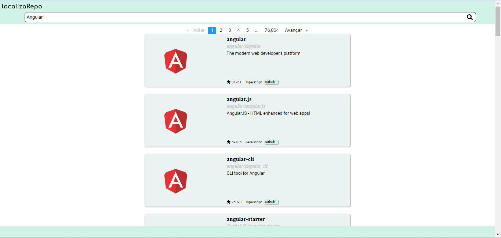

<h1 style="text-align: center; font-weight: bold;">localizaRepo</h1>

## 📸

<div align="center" >
  
</div>

---

## Sobre o Projeto

O projeto localizaRepo foi gerado com Angular CLI versão 13. A aplicação é destinada a pesquisar repositórios no github de forma resumida, onde é mostrado algumas informações importantes: **nome projeto**, **nome completo do projeto**, **descrição**, **stars** e **linguagem**.

No card que é apresentado, existe um botão onde clicado é levado para a pagina do projeto no **github**.


### 🛠️ Tecnologias

Foram utilizadas as seguintes ferramentas:

- [TypeScript](https://www.typescriptlang.org/)
- [Angular CLI](https://angular.io/cli)
- [ngx-pagination](https://github.com/michaelbromley/ngx-pagination#readme)
- [rxjs](https://rxjs.dev/guide/overview)

---
### Pré-requisitos

É necessário ter instalado as seguintes ferramentas:
[Git](https://git-scm.com), [Node.js](https://nodejs.org/en/).

### 🎲 Rodando o App

```bash
# Clonar o repositório
$ git clone https://github.com/alxc89/localizaRepo

# Acesse a pasta do projeto no terminal/cmd
$ cd localizaRepo

# Instale as dependências
$ yarn
# ou
$ npm install

# Execute a aplicação em modo de desenvolvimento
$ yarn start
# ou
$ npm run start
# ou
$ ng serve

```

<a href="https://www.linkedin.com/in/alex-cardoso-da-costa-764849bb/">
</a>
<br />

Veja meu Linkedin: [Alex Cardoso da Costa](https://www.linkedin.com/in/alex-cardoso-da-costa-764849bb/)