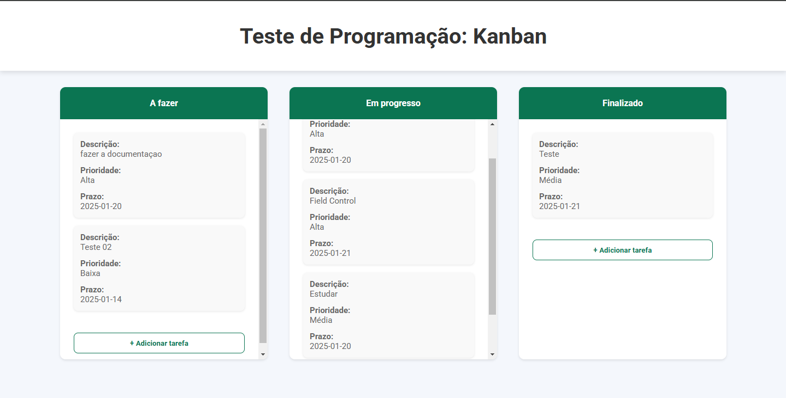
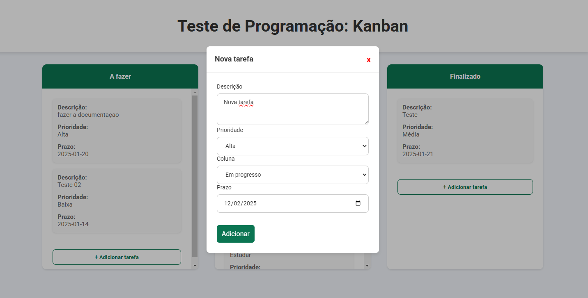
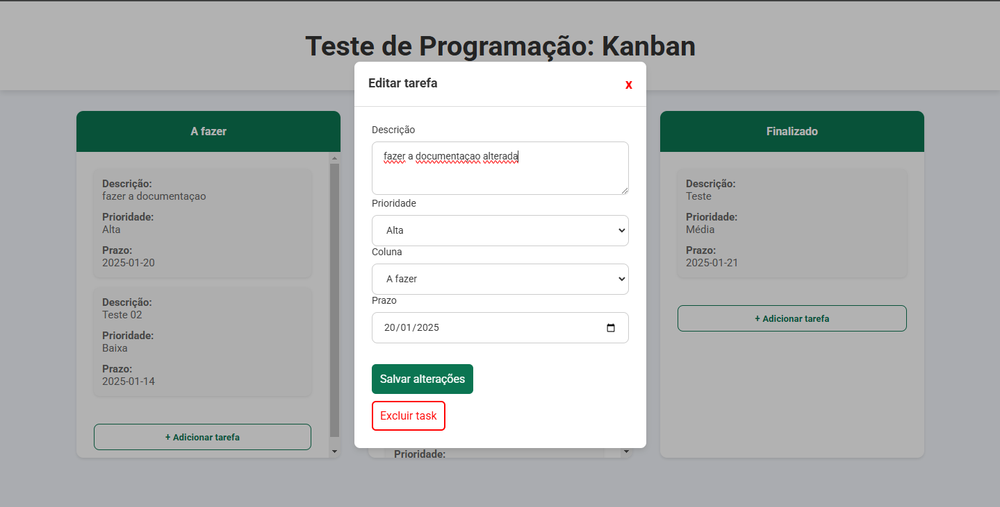
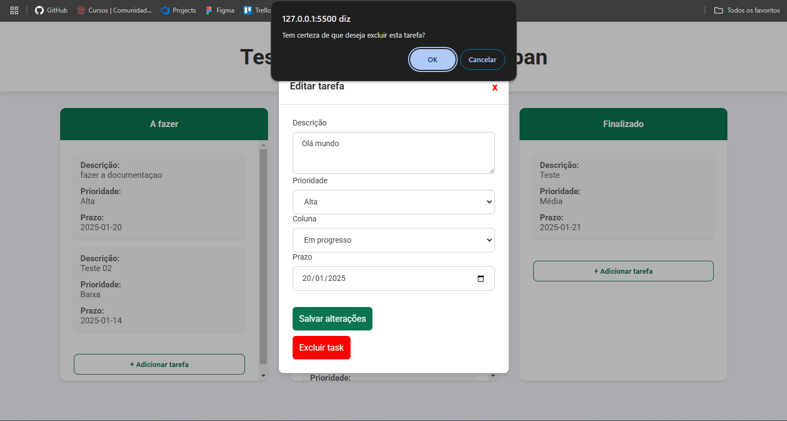
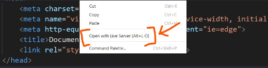

# Sistema Kanban | Fernando Lucas Vieira Junior

## Visão Geral do Sistema



Este sistema foi desenvolvido com **HTML**, **CSS** e **JavaScript** para o front-end, e **NestJS** para o back-end. O banco de dados utilizado foi **MySQL**, gerenciado via **phpMyAdmin** através do **XAMPP** (versão 8.2.12).

O objetivo principal do sistema é permitir a organização de tarefas em colunas representando diferentes estados (como "A Fazer", "Em Progresso" e "Concluído"), utilizando funcionalidades intuitivas como drag-and-drop e edição direta.

## Estrutura de páginas

KANBAN_DB_NEST
│
├── backend
│   └── (Código do servidor NestJS)
│
├── frontend
│   └── (Código do cliente)
│
├── prints_sistema
│   └── (Imagens ou capturas de tela do sistema)
│
└── readme.md
    └── (Documentação do projeto)

## Funcionalidades Principais

- **Adicionar Tarefas**: Criação de tarefas especificando descrição, prioridade, prazo e coluna inicial.



- **Editar Tarefas**: Modificação de qualquer atributo da tarefa existente.



- **Excluir Tarefas**: Confirmação de exclusão antes da remoção definitiva.



- **Drag-and-Drop**: Movimentação de tarefas entre colunas de forma intuitiva.


## Tecnologias Utilizadas

- **Front-end**:
  - HTML: Estrutura da interface.
  - CSS: Estilização.
  - JavaScript: Lógica de interação e integração com o back-end.
- **Back-end**:
  - NestJS: Framework para criar a API RESTful.
  - MySQL: Banco de dados relacional.
  - XAMPP: Ambiente de desenvolvimento local com suporte ao MySQL e phpMyAdmin.

## Versões Utilizadas

- **Node.js**: v22.13.0
- **NPM**: 10.9.2
- **NestJS**: 10.4.9
- **XAMPP**: 8.2.12

## Decisão de Não Usar Angular

O Angular não foi utilizado devido à minha falta de familiaridade com o framework no momento. Planejo estudar mais sobre Angular por meio de cursos e projetos futuros, a fim de incorporá-lo em implementações posteriores.

## Configuração e Execução

### Pré-requisitos

- **Node.js** (versão 14 ou superior)
- **NPM** 
- **XAMPP** (com MySQL e phpMyAdmin configurados)
- **Live Server** (extensão do visual studio code)

### Passos para Configuração

1. Clone o repositório:
   ```bash
   git clone <URL_DO_REPOSITORIO>
   ```

2. Configure o banco de dados:
   - Inicie o XAMPP e habilite o servidor MySQL.
   - Acesse o **phpMyAdmin** através de `http://localhost/phpmyadmin`.
   - Crie um banco de dados chamado `kanban_nest`.

3. Navegue até a pasta do back-end:
   ```bash
   cd kanban_db_nest/backend
   ```

4. Instale as dependências:
   ```bash
   npm install
   ```

5. Inicie o servidor:
   ```bash
   npm run start
   ```

   O servidor estará disponível em `http://localhost:3000`.

6. Abra o arquivo `index.html` na pasta `frontend` utilzando o live server.


## Considerações Finais

O sistema foi projetado para ser simples e funcional, atendendo aos requisitos básicos de um Kanban. Desenvolvê-lo foi desafiador, mas uma experiência extremamente enriquecedora, especialmente no uso do NestJS e na implementação do drag-and-drop. Apesar de não ter utilizado um framework no front-end, a abordagem escolhida assegurou uma entrega eficiente dentro do prazo estipulado.

Se houver dúvidas ou necessidade de suporte, sinta-se à vontade para entrar em contato!
